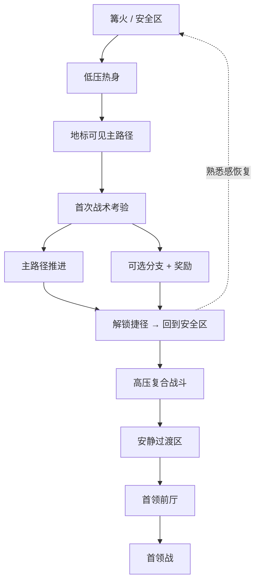

# 调研 — GitHub 与 Godot 类魂游戏生态

**日期:** 2026-07-30
**状态:** `ACTIVE` — 调研完成；已提供实施建议
**参见:** [`research-dark-souls-design.md`](research-dark-souls-design.md) — 12 主题黑暗之魂设计审计、垂直切片检查清单
**参见:** [`research-dark-souls-weapons.md`](research-dark-souls-weapons.md) — 各风格武器调校、卡肉、霸体
**参见:** [`research.md`](research.md) — 原始类魂垂直切片调研、Godot API 映射

调研于 2026-07-30 进行，旨在调查 Godot 类魂生态系统：GitHub 仓库、Godot 资源库模板、黑暗之魂设计方法论，以及适用于 Ashen Hollow 垂直切片的实施模式。

---

## 信息来源可靠性声明

本报告使用三级证据分类：

| 标签 | 标准 |
|---|---|
| **可观察规则** | 可通过 GitHub 仓库内容、Godot 资源库列表、Godot 官方文档或公开访谈进行验证。 |
| **开发者意图** | 需要来自可追溯、可访问的访谈、演讲或官方出版物中具名开发者的引述。 |
| **分析** | 基于可观察制品构建的解读。必须标注为分析。 |

使用 Perplexity 深层搜索和网络搜索进行发现。仓库指标（星标、Fork、Issue）通过 GitHub 页面观察获取，自访问以来可能已略有变化。所有代码示例均为基于多个仓库和 Godot 官方文档中观察到模式的原创综合 — 并非从任何单一来源复制。

---

## 1. 执行摘要

两条研究线索并行开展：**源代码和模板生态**（明确标记为类魂的 GitHub 仓库和 Godot 资源库条目）以及**原始设计方法论**（为什么黑暗之魂给人黑暗之魂的感觉，以及如何将其分解为可复用的 Godot 模块）。

Godot 资源库中最直接可复用的类魂资产集中在 **catprisbrey 的两个模板**上。GitHub 镜像了这些模板，并增加了 Godot 3/4 控制器、BreadbinEngine、NovemberDev 的 3D 复刻教程示例，以及少量 2D Godot/C# 原型。英文仓库占主导地位；中文资源更倾向于教程、解读和实现视频，而非高星标、持续维护的公共仓库。

从原始设计角度而言，黑暗之魂的核心并非"纯粹的难度"，而是**可学习的公平性**、**高风险/高回报的决策结构**、**通过捷径和环路带来的空间惊喜**、**由行为模式而非数值膨胀驱动的敌人和首领挑战**，以及**嵌入空间、物品描述和玩家观察中的叙事**。宫崎英高在《黑暗之魂设计艺术》访谈中反复强调，关卡并非先构建好美术再填入玩法，而是先以粗略地图建立"结构、需求和氛围"，然后由设计师和美术师协作完善。

对 Godot 开发者而言，最可靠的路径不是预先构建一个"完整的类魂游戏"，而是将系统分解为七个松散耦合的层次：**角色移动、动画与根运动、武器与帧数据、碰撞/打击检测、耐力/韧性/破防、敌人/首领 AI，以及包含死亡-恢复循环的关卡设计**。Godot 官方文档提供了核心构建块：用于可控移动的 `CharacterBody3D`，用于动作编排的带有根运动 API 的 `AnimationTree` / `AnimationNodeStateMachine`，用于打击检测的 `Area3D` / `RayCast3D` / 形状查询，用于敌人 AI 和低耦合通信的 `NavigationAgent3D` 和信号，以及用于武器、招式表和首领配置等数据资产的 `Resource`。

### 前提假设

目标平台、团队规模、预算和时间线未指定。本报告默认为：**PC/以控制器为主、单人游戏、垂直切片优先**。团队规模建议参见第 9 节。

---

## 2. 搜索范围和方法

搜索了四个来源类别：

1. **GitHub 仓库页面** — 描述、功能范围、星标/Fork/Issue、提交历史、README 实施细节。
2. **GitHub Issues** — 通常比 README 更能暴露边缘情况的真实成熟度（攻击连段、锁定、状态转换、根运动位移、导入兼容性）。
3. **Godot 资源库** — 确认引擎版本、许可证、发布日期和官方列表状态。
4. **Godot 官方文档、原始设计访谈和学术来源** — 支持设计理由和实施路径，而不仅仅是仓库列表。

使用的关键词：`soulslike godot`、`souls-like controller godot`、`dark souls clone godot`、`godot 4 souls-like template`、`Dark Souls design works interview`、`godot behavior tree`，以及中文对应词 `Godot 类魂`、`Godot 魂类 状态机`、`GitHub 类魂 Godot 中文`。

仓库选择优先级：**官方渠道交叉验证** > **Godot 4 优先于 Godot 3** > **星标/Fork/Issue 显示社区采用率** > **README 明确交代实施边界** > **模块可复用性**。

---

## 3. 黑暗之魂核心设计原则

下表将黑暗之魂设计原则转化为**设计意图**和**实施需求** — 可直接用于 Godot 项目。

| 设计原则 | 设计意图 | 实施需求 |
|---|---|---|
| 难度曲线不是线性数值膨胀 | 黑暗之魂以难度著称，但成熟分析将其框定为"难但公平"：游戏前期往往最具惩罚性，因为玩家尚未学会规则，而非敌人数值极端。随着玩家学习翻滚时机、走位、耐力管理和敌人节奏，主观难度会下降。 | 使用**行为复杂度**代替纯数值膨胀。将高压门卫敌人放置在可见位置，作为"你可能还没准备好"的空间信号。决不允许敌人通过瞬间转身、零预兆攻击或扭曲的碰撞盒作弊。 |
| 风险与回报绑定在同一循环中 | 探索隐藏区域、收集掉落物和推进前进都会产生回报，但死亡会让一整趟的收益面临风险。这使得"继续前进"成为策略性问题，而不仅仅是按住向前。 | 每个高价值区域必须搭配**可感知的危险**：更硬的敌人、狭窄地形、远程压力、坠落风险或长交战链。回报必须同样清晰：捷径、稀有武器、升级材料或知识收益。 |
| 战斗是节制的，不可乱按 | 好的魂系战斗强调动作重量、起手/收招、站位、节奏和耐力。玩家和敌人都在类似规则下运作。Game Wisdom 的表述：双方都不应滑入割草游戏领域。 | 按动作定义启动帧、活跃帧、恢复帧、位移、攻击判定框、耐力消耗、可取消窗口和输入缓冲。武器差异来自动作形态和风险结构，而非纯 DPS。重武器必须慢，但以更高的打断力、破防力或空间收益作为补偿。 |
| 世界互联是情感设计，不是技术炫耀 | 宫崎英高在访谈中表示，许多关卡最初以粗糙地图的形式确定结构，然后美术和功能共同生长。有些区域"向各个方向连接"，电梯、水车、环路和捷径在疲惫的玩家突然回到熟悉的安全地带时产生强烈的释然感。亚诺尔隆德被明确视为游戏中期的情感高潮。 | 将地图设计为**主路径 + 若干环形捷径 + 可选分支**。捷径不仅是省时；它们将陌生折叠回熟悉，帮助玩家在世界中重新定位自己。主要地标、电梯、桥梁和垂直重连接点都承载认知地图功能。 |
| 敌人和首领的挑战来自行为，而非作弊 | 对黑暗之魂的分析一致强调，敌人之所以难，是因为其行为考验玩家，而非因为读帧、瞬移或规则豁免。首领是建立在与普通敌人相同规则之上的独特战术问题，而非"更大更厚的杂兵"。 | 普通敌人围绕距离、朝向、破绽和群体站位构建。首领需要清晰可读的阶段结构、攻击节奏、空间推拉、站位惩罚和机会窗口。不要仅仅把首领做大、堆高血量 — 构建**阅读 → 反应 → 贪刀管理**循环。 |
| 学习曲线依赖于"观察 → 试错 → 纠正" | 学术分析将黑暗之魂描述为"序列决策 + 迭代学习"系统：失败降低不确定性，逐渐将未知的敌人、路线和机制转化为可预测的模式。 | 新敌人应在首次遭遇时给予玩家观察时间。首领的第一轮动作应传达核心语法。死亡惩罚必须是真实的，但重返战斗的时间不能太长，以至于学习被赶路冲淡。 |
| 资源管理是行为边界，而不仅仅是数字 | 在黑暗之魂的奖励结构中，"资源"包括生命值、货币、时间、位置和情感耐受 — 不仅仅是 HP 和耐力。耐力条、回复次数、消耗品和法术次数都塑造了玩家能否继续施压、贪刀还是必须撤退。 | 让耐力在攻击/防御/闪避/冲刺之间真正竞争。治疗必须有清晰的起手和风险暴露。消耗品不应替代核心战斗判断，而应在构筑或特定战术中放大风格差异。 |
| 叙事让玩家成为参与者，而非接收者 | IntechOpen 的叙事分析指出，黑暗之魂主要通过环境、空间暗示、物品描述和少量过场来讲述故事 — 而非对话堆砌。玩家被迫扮演档案管理员/考古学家的角色，从碎片中主动拼凑含义。《卫报》对宫崎英高的访谈将这种方法追溯到他童年时期通过插图填补想象来阅读外文小说的经历。 | 将叙事材料分布在**尸体摆放、建筑状态、敌人类型、物件布置、捷径语义、物品文本和 NPC 对话偏差**中。真正重要的信息不应仅存在于 UI 文本中 — 它应由空间本身承载。 |
| 节奏设计必须遵循"压迫 → 释放 → 压迫" | 亚诺尔隆德在访谈中被描述为一个旨在让玩家感到"我终于到了"的区域，表明黑暗之魂的关卡并非持续高压 — 它们在疲劳、警觉、恢复和宏大之间编排序列。 | 在每个主要关卡内：热身区段、探索区段、伏击区段、捷径解锁、安静空间、首领前厅。持续高压会麻痹玩家；没有恢复段，成就感无法被放大。 |
| 重玩价值来自构筑、路径和知识共享 | 黑暗之魂的重玩性不仅仅是 NG+ 数值缩放 — 它来自武器风格、属性构筑、不同路线、可选区域和社区知识的持续交流。在学术上，这被描述为"元学习和共享知识"共同推动难度消解和持续参与。 | 系统必须支持**不同的武器类型、不同的伤害维度、不同的成长曲线、不同的区域进入顺序**。关卡必须允许玩家根据装备、技能或信息差距重构路线。 |

压缩为一条开发准则：**不要复刻受苦美学 — 要复刻可学习的空间-战斗-资源耦合。**这就是为什么许多类魂作品复制了翻滚、魂掉落和篝火，却无法复刻黑暗之魂的感觉。

---

## 4. 关卡设计模式

黑暗之魂的关卡设计不仅仅是"复杂的地图"。它将空间认知、敌人分布、捷径环路、叙事暗示和情感节奏捆绑在一起。宫崎英高在《设计艺术》中明确表示，许多区域最初是向美术师传达"需求、结构和外观"的粗略地图 — 意味着原始作品中的关卡设计始终是框架层，而非后期装饰。

### 五个可复用原则

1. **主路径必须清晰，但不能像走廊。**通过地标、光线、垂直性、远处建筑、敌人朝向和拾取物摆放来引导 — 而不是箭头或任务标记。病村的水车、电梯和下沉式下降在空间上可视化"深入更深处"。

2. **捷径必须重写玩家的心理地图。**真正好的捷径不是"节省 30 秒" — 而是"这个地方和那个地方在同一个世界中"。它通过空间折叠将压力转化为掌控感。

3. **敌人摆放负有教学职责。**将敌人放置在角落、窄桥、楼梯、门后、远程高地和盲区，教授观察、举盾应对、卡角、拉怪和拆阵 — 而不仅仅是伏击惩罚。

4. **节奏必须是分段的。**安全区、热身段、探索段、惊喜/伏击段、捷径解锁、首领静默、首领战 — 这种结构同时放大压力和成就感。

5. **关卡必须讲故事。**为什么这个敌人在这里？为什么物品这样排列？为什么这具尸体朝向那个方向？为什么这件物品在边缘或祭坛上？这些全都构成叙事，而不仅仅是美术装饰。

### 四种布局模式

| 模式 | 用途 | 解决的问题 |
|---|---|---|
| 环形环路 | 从篝火出发，经过战斗点，通过高电梯、门闩或梯子重连回起点。 | 强化世界互联感，减少重复赶路，创造"我一直就在这上面"的惊喜。 |
| 枢纽-辐条 | 一个安全区或中庭锚定若干压力不同的分支。 | 允许玩家在被阻挡时切换路线，保持探索自主权，而非纯粹线性推进。 |
| 垂直堆叠 | 上层用于视线引导和远程压力，下层用于近战和坠落风险，通过梯子/水车/电梯连接。 | 在有限占地面积上实现高密度探索和空间记忆。 |
| 首领前厅 | 首领门前的相对平静空间，用于恢复、观察和构筑调整。 | 将"学习首领"与"在途中被杂兵消耗"分离，提高感知公平性。 |

### 典型类魂关卡骨架

以下拓扑并非任何特定原始地图的复制 — 它是一个适用于 Godot 垂直切片的通用骨架，源自黑暗之魂的粗略地图协作方法、捷径逻辑，以及首领学习不能被长跑路冲淡的原则。



### 敌人摆放策略

最有效的策略不是堆叠数量 — 而是用**组合创造问题**。例如：一个近战敌人逼迫玩家后退，而高处的远程敌人封死撤退路线；一个缓慢、控制空间的高级精英占据房间，而两个小型敌人打乱节奏；一个窄走廊持盾敌人迫使玩家绕圈，暴露给侧面突刺敌人。这符合魂系核心：难度来自情境判断，而非纯反应速度。

### 视线和探索引导

使用三层结构：**远处地标**（告诉玩家"我要去那里"）、**中程威胁**（制造谨慎推进）、**近程奖励**（引诱分支探索）。不要在每个角落放发光宝箱。不要把每件好物品放在主路径中线上。类魂探索的乐趣来自玩家自己将风险解读为机会。

---

## 5. Godot 系统实现

如果你要在 Godot 中构建一个有说服力的类魂原型，最高优先级不是先写首领 AI — 而是**解耦数据、动作和打击检测**。Godot 官方文档指出 `AnimationTree` 作为动画过渡控制中心、`CharacterBody3D` 用于高级角色移动、`Area3D` 和空间查询用于打击检测、信号用于低耦合对象间通信，以及 `Resource` 作为武器、招式表和敌人配置的自然数据载体。这些原则与 catprisbrey 模板的"信号 + 松散代码 + 动画库"理念高度契合。

### 推荐架构

| 模块 | 推荐数据结构 | 关键 Godot 节点 / API | 实施重点 |
|---|---|---|---|
| 角色移动 | `CharacterController` + `MovementConfig` | `CharacterBody3D`、`move_and_slide()` | 分离自由奔跑、锁定侧移、冲刺、闪避、受击反应位移。不要硬编码攻击位移 — 优先与动画位移协调。 |
| 动画与状态 | `AnimationState`、输入缓冲队列 | `AnimationTree`、`AnimationNodeStateMachine`、过渡条件 | 统一管理待机/移动/闪避/攻击/受击/硬直/死亡。允许输入缓冲但严格控制可取消窗口。 |
| 根运动 | `RootMotionPolicy` | `AnimationTree` / `AnimationMixer.get_root_motion_position()`、`get_root_motion_rotation()`、`RootMotionView` | 攻击、闪避、终结技 — 高表现力动作优先使用根运动。一般导航跑步可采用代码驱动。 |
| 打击检测 | `AttackDef`、`HitboxScene` | `Area3D`、`RayCast3D`、`PhysicsDirectSpaceState3D.intersect_shape()` | 近战："激活窗口 + 去重命中列表"。长柄武器：添加前向形状查询以减少漏判。 |
| 武器与招式表 | `WeaponData`、`AttackChain`、`DamageProfile` | `Resource`、`ResourceLoader` | 武器是数据，不是代码分支。将动作名称、伤害倍率、耐力消耗和打断值写入资源。 |
| 耐力 / 韧性 / 破防 | `StatsComponent`、`PoiseComponent` | `Timer` / `SceneTreeTimer`、信号 | 攻击、格挡和闪避共享一个耐力池。韧性和破防必须能够中断状态机，受霸体/韧性控制。 |
| 敌人与首领 AI | `感知` + `决策` + `动作` 三层 | `NavigationAgent3D`、状态模式、BT/SM 插件如 LimboAI 或 Beehave | 推荐"宏观行为树 + 微观战斗状态机"混合：BT 处理追击/脱离/绕圈，FSM 处理一次攻击的完整生命周期。 |
| 低耦合通信 | `CombatEvents`、`TargetEvents` | 信号 | 命中、死亡、目标切换、耐力耗尽、首领阶段转换 — 全部通过事件广播，而非链式 `get_node()` 调用。 |

### 武器和招式表数据

以下 GDScript 并非从任何单一仓库复制 — 它综合了 Godot 的 `Resource` 数据容器模式与 BreadbinEngine 的"字符串数组动画名称驱动招式表"方法。好处是：设计师直接编辑资源文件；程序员只需维护一个战斗执行器。

```gdscript
# weapon_data.gd
class_name WeaponData
extends Resource

@export var weapon_id: StringName
@export var display_name: String
@export var stamina_cost_light: float = 18.0
@export var stamina_cost_heavy: float = 32.0
@export var damage_physical: int = 100
@export var damage_fire: int = 0
@export var block_guard_damage: int = 25
@export var poise_damage: float = 20.0

# 每个动作是一个 AttackDef；映射到 AnimationTree 状态名称或 AnimationLibrary 动画名称
@export var light_chain: Array[AttackDef]
@export var heavy_chain: Array[AttackDef]
@export var roll_attack: AttackDef
@export var running_attack: AttackDef


# attack_def.gd
class_name AttackDef
extends Resource

@export var anim_state: StringName
@export var startup_sec: float = 0.18
@export var active_sec: float = 0.10
@export var recovery_sec: float = 0.35
@export var hitbox_scene: PackedScene
@export var motion_scale: float = 1.0
@export var can_chain_on_hit: bool = true
@export var can_chain_on_block: bool = false
@export var i_frame_begin_sec: float = -1.0  # -1 = 无无敌帧
@export var i_frame_end_sec: float = -1.0
```

这些数据至少应覆盖：**动作名称、启动、活跃、收招、耐力消耗、伤害倍率、破防值、韧性伤害、位移倍率、输入缓冲窗口、是否允许连段**。没有这些字段，类魂战斗会迅速退化为"播放动画 + 减去 HP"。有了它们，轻击、重击、跑攻、翻滚攻击、跳劈、蓄力和弹反-处决全部通过一个统一管道流动。

### 打击检测、耐力和输入缓冲

Godot 的 `Area3D` 天然适合近战攻击判定框 — 它支持进入/离开/重叠检测。扫荡型武器可以叠加 `intersect_shape()` 或 `RayCast3D` 进行补偿命中。Timer / SceneTreeTimer 适合无敌帧窗口、恢复窗口和耐力回复延迟。

```gdscript
# 近战攻击执行器（简化版）
var already_hit: Dictionary = {}
var stamina: float = 100.0
var stamina_regen_cooldown := 0.0

func perform_attack(def: AttackDef, weapon: WeaponData) -> void:
    if stamina < weapon.stamina_cost_light:
        return

    stamina -= weapon.stamina_cost_light
    stamina_regen_cooldown = 0.6

    anim_tree["parameters/playback"].travel(def.anim_state)

    await get_tree().create_timer(def.startup_sec).timeout
    _open_hitbox(def)

    await get_tree().create_timer(def.active_sec).timeout
    _close_hitbox()

    await get_tree().create_timer(def.recovery_sec).timeout
    emit_signal("attack_recovered")

func _open_hitbox(def: AttackDef) -> void:
    already_hit.clear()
    var hb := def.hitbox_scene.instantiate()
    hb.body_entered.connect(_on_hitbox_body_entered)
    $Hitboxes.add_child(hb)

func _close_hitbox() -> void:
    for c in $Hitboxes.get_children():
        c.queue_free()

func _on_hitbox_body_entered(body: Node) -> void:
    if already_hit.has(body):
        return
    already_hit[body] = true
    body.call_deferred("apply_hit", {
        "damage": 100,
        "poise_damage": 20.0,
        "guard_damage": 25
    })

func _physics_process(delta: float) -> void:
    if stamina_regen_cooldown > 0.0:
        stamina_regen_cooldown -= delta
    else:
        stamina = min(100.0, stamina + 30.0 * delta)
```

三个关键点：(1) **每次挥击必须去重**，否则多帧重叠会计算为多次命中；(2) **耐力消耗后必须延迟回复**，否则玩家总是倾向于无脑翻滚或轻击连打；(3) **攻击恢复事件必须显式发出**，让状态机决定是连段还是回到待机。真正的类魂感觉往往不来自更复杂的输入，而来自更严格的"何时无法行动"。

### 首领 AI 和阶段控制

不要用一个巨大的状态机解决首领 AI。在 Godot 中，更稳定的方法是：**导航/站位/追击/脱离**使用行为树或上层决策状态；**单次攻击的生命周期**使用本地状态机。Godot 没有内置完整的 BT 编辑器，但资源库和 GitHub 生态提供了成熟的解决方案，如 LimboAI（行为树 + 状态机）和 Beehave（3k+ GitHub 星标，社区验证可用于复杂 NPC 和首领行为）。

```gdscript
# boss_brain.gd（伪代码）
enum Phase { PHASE_1, PHASE_2 }

var phase := Phase.PHASE_1
var cooldowns := {
    "slash_combo": 0.0,
    "gap_close": 0.0,
    "aoe_burst": 0.0
}

func decide_next_action(dist: float, player_healing: bool, my_hp_ratio: float) -> StringName:
    if my_hp_ratio < 0.5 and phase == Phase.PHASE_1:
        phase = Phase.PHASE_2
        return &"phase_transition"

    if player_healing and dist < 8.0 and cooldowns["gap_close"] <= 0.0:
        return &"gap_close"

    if dist < 2.5 and cooldowns["slash_combo"] <= 0.0:
        return &"slash_combo"

    if dist > 5.0 and cooldowns["gap_close"] <= 0.0:
        return &"gap_close"

    if phase == Phase.PHASE_2 and cooldowns["aoe_burst"] <= 0.0:
        return &"aoe_burst"

    return &"reposition"
```

原则是：**首领的难度来自条件响应的可读性和时机压力，而非纯随机性。**当玩家治疗时，首领可能倾向于拉近距离。当玩家贴得太近时，首领倾向于近战连段或近距离 AoE。阶段二不仅仅增加伤害 — 它引入新的空间强制机制。这最接近黑暗之魂的阅读-学习逻辑。

### 模型和动画导入

Godot 官方的 `AnimationTree` 和根运动文档至关重要：如果你希望攻击的步法、闪避距离、终结技对齐和推门力道与动画匹配，请将位移放在根骨骼中，并通过 `get_root_motion_position()` / `get_root_motion_rotation()` 提取。Cat 的模板明确要求兼容 Godot/Unity/Mixamo 标准骨骼映射 — 在原型阶段，这极大地降低了替换模型和动画库的成本。

---

## 6. 代表性仓库对比

下表优先考虑**代表性、可复用性和项目风险** — 而非原始星标数。标记为"~"的指标为近似快照；在此粒度下足以供选择决策使用。

| 仓库 | 语言 / 引擎 | 范围 | 指标 | 优势 | 局限性 / 风险 | 可复用模块 |
|---|---|---|---|---|---|---|
| `catprisbrey/Cats-Godot4-Modular-Souls-like-Template` | Godot 4.2；GDScript/场景；信号 + 动画库驱动 | 3D 类魂完整族系模板：根运动、主/副手武器、物品、锁定、击退、格挡/完美格挡、闪避、冲刺、梯子、交互、敌人多状态 + 寻路、布娃娃死亡、110+ 动画 | ~400★ / 60+ Fork / 3 个待解决 Issue | 当前最佳 Godot 4 类魂原型基础；模块全面、资产完整、复用门槛低；README 明确声明目标是"替换模型和动画而不破坏逻辑" | README 声明 v3.0 将彻底重写旧代码；待解决 Issue 已暴露攻击连段卡死、斧状态卡死 — 表明这是原型脚手架，而非已调试产品 | 玩家控制器、AnimationTree 架构、锁定、武器/物品、敌人状态、交互道具、关卡灰盒资产 |
| `catprisbrey/Third-Person-Controller---Godot-Souls-like` | Godot 3.5；GDScript；暴露 `PlayerTemplate.gd`、`CameraTemplate.gd` | 3D 控制器模板：360 度摄像机、锁定侧移、连招、特殊攻击、键盘/鼠标 + 手柄 | ~120★ / 21 Fork / 0 Issue | 结构更聚焦，适合学习"最小类魂控制器"而不被完整模板淹没 | Godot 3.5；如果项目从 Godot 4 开始，迁移成本不可忽视 | 第三人称摄像机、输入映射、基础连招、AnimationTree 集成工作流 |
| `catprisbrey/Third-Person-Controller--SoulsLIke-Godot4` | Godot 4；GDScript；3.5 模板的早期移植 | 快速角色模型 + 动画树挂接，涵盖移动、闪避、连招攻击、基础摄像机 | ~45★ / 8 Fork / 0 Issue / 12 次提交 | Godot 4 快速启动；适合只想复用角色控制和摄像机的人 | 作者标注为"早期/过时移植"；更像是迁移示例而非成熟基础 | 基于 CharacterBody3D 的控制器、Godot 4 动画集成、最小场景组织 |
| `CornflakeWoof/BreadbinEngine` | Godot 4；清晰的脚本目录、GDScript 工作流 | 面向黑暗之魂/血源诅咒感觉的 3D ARPG 框架，强调可扩展性。最有价值：软编码招式表和在 Inspector 中可调的 AI 倾向 | 16★ / 0 Fork / 0 Issue / 8 次提交 | 适合研究数据驱动武器系统和可调 AI 倾向 | 社区验证度低，提交少 — 更像是早期框架实验而非多用户模板 | 武器资源/招式表、可配置 AI、数据驱动 ARPG 思维 |
| `NovemberDev/novemberdev_soulslike_darksouls_godot` | Godot 3D 项目；教程配套示例 | "如何在 Godot 中制作 3D 黑暗之魂复刻"视频配套仓库 | ~70★ / 11 Fork / 1 个待解决 Issue | 直观、低门槛；适合了解"一个最小类魂复刻实际需要哪些系统" | 教程项目；待解决 Issue 仍在基础功能报错层面 — 不是用于内容生产的基础 | 最小玩家-敌人-攻击循环、教程式分解路径 |
| `alex-musick/darksoulsclone-2d` | Godot .NET / C#；README 声明"使用 Godot .NET 和 C# 开发" | 2D 类魂原型，目前更接近 mob 割草格斗游戏，但示范了 C# 角色、AI 和房间组织 | 1★ / 0 Fork / 0 Issue / 80 次提交 | 如果你偏好 C# 而非 GDScript，这个仓库比大多数 2D Godot 类魂示例更具教学价值 | 完成度有限，社区验证弱；更适合 2D 战斗循环实验而非规范 3D 类魂 | C# 玩家/怪物分层、2D 招式表实验、房间原型 |
| `zakkor/dungeon` | Godot；俯视 2D | 俯视 2D 类魂 — 适合研究简化的风险-探索-敌人-摆放循环 | 小社区 | 启发 2D 原型思维 | 社区足迹较小；作为补充参考而非主参考 | 简化探索循环、2D 敌人摆放模式 |
| `SenZmaKi/gyattsouls` | Godot；2D | 混合类魂 + 银河恶魔城 — 适合研究 2D 中的武器节奏 + 路径门控 | 小社区 | 启发 2D 混合思维 | 社区足迹较小 | 2D 中的武器节奏 + 路径锁定组合 |

### 选择摘要

- **最快路径到可运行的 3D 类魂基础：** Cat 的 Godot 4 模板 — 最全面、文档最好、最可复用。
- **最佳研究数据驱动武器系统：** BreadbinEngine — 软编码招式表和 AI 倾向思维。
- **最适合教程式理解：** NovemberDev — 最小复刻，逐步讲解。
- **最适合 2D 类魂实验：** `darksoulsclone-2d` 和 `dungeon`。
- **Godot 3 参考：** catprisbrey 的 Godot 3.5 控制器模板 — 聚焦且干净，但存在迁移成本。

### Godot 资源库条目

两个条目可直接搜索且信息完整：

- **Godot 4 Souls-Like Template** (catprisbrey) — Godot 4.2，上述 GitHub 仓库的资源库镜像。
- **Third Person Controller Template -- Melee-Souls-Like** (catprisbrey) — Godot 3.4，Godot 3 控制器的资源库镜像。

---

## 7. 可复用模块检查清单和里程碑

由于目标平台、团队规模、预算和时间线未指定，最合理的做法是将类魂游戏分解为**按优先级和难度分级的可复用模块检查清单**。顺序是：先可玩，再正确，后丰富。在前两级稳固之前，不要涉足大世界、多个首领、复杂叙事或广泛的构筑分支。

| 优先级 | 模块 | 难度 | 理由 |
|---|---|---|---|
| **必须完成** | 玩家移动、摄像机、锁定、基础闪避 | 中 | 这是类魂"手感"赖以立足的基础。没有它，所有后续战斗调校都是扭曲的。直接参考 catprisbrey 的两个控制器模板。 |
| **必须完成** | 动画状态机、输入缓冲、受击硬直打断 | 高 | 类魂的风味来自动作不可取消、命中具有反馈、输入可缓冲但不可连按。Godot 的 `AnimationTree` / 状态机正是为此设计的。 |
| **必须完成** | 武器数据、打击检测、伤害/韧性/耐力 | 高 | 没有这一层，就只是"砍一下，减 HP" — 而非类魂。BreadbinEngine 的软编码招式表思维可复用性很高。 |
| **必须完成** | 一个基础敌人 + 一个精英敌人 + 一个教程首领 | 高 | 敌人行为是魂系感觉的主要来源。至少需要"杂兵 → 精英 → 首领"三级，学习曲线才能显现。 |
| **必须完成** | 一个环形关卡 + 一个捷径 + 一个首领前厅 | 中 | 这是将"类魂空间语法"放入游戏的最小单位。没有捷径和没有环回意味着你只是在做一个第三人称动作关卡。 |
| **应该完成** | 格挡 / 完美格挡 / 破防 / 韧性 | 高 | 这些系统将战斗从单路径扩展为多路径，决定了高水平玩法的上限。Cat 的模板已提供扎实的原型参考。 |
| **应该完成** | 篝火/存档/重生、掉落资源恢复 | 中 | 没有失败循环 = 没有风险-回报结构。 |
| **应该完成** | 远处地标、环境叙事、物品文本 | 中 | 这是从"系统正确"到"感觉像黑暗之魂"的关键步骤。 |
| **可以完成** | 多种武器类型、多种构筑、可选分支 | 高 | 这是重玩价值层；它会显著延长时间线。只有在垂直切片稳定后才扩展。 |
| **可以完成** | AI 行为树插件集成 | 中 | 当敌人和首领数量增长时，手写 FSM 会迅速膨胀。在此阶段适合引入 LimboAI / Beehave。 |

### 团队规模建议

**独立开发者：**最适合"现有模板 + 一把近战武器 + 一个精英 + 一个首领 + 一个环形关卡"。不要在第一阶段自行构建完整 AI 编辑器、角色建模管线或数十套动画集。你真正需要的是：拿一个成熟的 Godot 4 模板，让动画树、根运动、受击反应和关卡环回跑通，然后构建一把武器的完整帧数据。对独立开发者来说，最有价值的不是"更多内容"，而是"更少的不受控变量"。Cat 的模板在这里有巨大优势。

**小团队：**最适合"程序员构建系统、美术师提供资源、设计师调校表格" — 三方分工。关键是将所有武器、敌人和首领资源化，这样新增武器时程序员不需要每次都触碰核心状态机。BreadbinEngine 的软编码招式表思维、Godot 的 `Resource` 数据容器和基于 Signals 的低耦合通信都非常适合 3–5 人规模。

**中型团队：**只有在这个规模下，才值得系统地构建内容管线：敌人族系、武器族系、战斗事件总线、首领阶段脚本、关卡灰盒到美术替换、统一摄像机规则、统一地标语言、统一叙事摆放规范。不先建立这些"语法"，中型团队最常见的失败模式不是"做不出来"，而是"每个区域玩起来像不同的游戏"。宫崎英高《设计艺术》中强调的"先做粗略地图 + 主题统一 + 个体艺术家风格在统一框架内表达"在此尤其重要。

### 粗略工时估算

基线：PC 单人、手柄优先、垂直切片优先。如果你需要从零构建 3D 角色、动捕、音频、完整叙事和大量场景资产，工时将显著增加。

| 目标产出 | 独立开发者 | 小团队 | 中型团队 |
|---|---:|---:|---:|
| 可玩原型 | 200–350 小时 | 总 300–600 小时 | 总 500–900 小时 |
| 垂直切片 | 700–1200 小时 | 总 1200–2200 小时 | 总 1800–3200 小时 |
| 第一章试玩 | 1500–2500 小时 | 总 3500–6000 小时 | 总 8000–15000 小时 |

这些估算假设：(1) 最大化复用现有模板和公共资产；(2) 先构建一套武器/一个首领/一个关卡语法，然后扩展。如果反向操作 — 先做五种武器类型、十张地图、七个首领、大量叙事文本 — 在"类魂语法"真正被验证之前，你很可能已被内容量压垮。

---

## 8. Godot 实现模式 — 三种分类

从代表性仓库来看，Godot 类魂实现可分为三类：

### 类别 1：控制器模板

示例：catprisbrey 的 Godot 3.5 和 Godot 4 控制器。

**优势：**最快路径到可运行的角色 + 摄像机。聚焦的范围意味着需要审查的代码更少。

**劣势：**不包含武器数据系统、敌人 AI 或关卡基础设施。这些需要你自己提供。

**最适合：**希望从可运行角色开始而非从 `CharacterBody3D` 文档开始的独立开发者和小团队。

### 类别 2：模块化脚手架

示例：Cat 的 Godot 4 模板。

**优势：**锁定、武器、物品、敌人状态、寻路、梯子、格挡、根运动全部打包为可重组的系统。包含 110+ 片段的动画库。

**劣势：**README 警告即将到来的 v3.0 重写。待解决 Issue 显示边缘情况（攻击链死锁、斧状态卡死）。将其视为原型脚手架，而非无 Bug 产品。

**最适合：**希望获得完整系统蓝图预接线，并愿意以调试换取巨大时间节省的团队。

### 类别 3：数据驱动框架

示例：BreadbinEngine。

**优势：**软编码招式表（动画名称来自字符串数组，而非硬编码枚举分支）。AI 倾向可在 Inspector 中调校。思维本身就是资产，即使仓库很小。

**劣势：**社区验证度低，提交少。早期实验，而非多用户模板。

**最适合：**已有控制器、希望研究如何数据驱动武器和 AI 而不陷入死胡同的团队。

### 你应该实际复用什么

数据驱动和事件驱动的组织模式 — 而非任何单一仓库的场景树。从 Cat 的模板获取控制器和系统骨架。从 BreadbinEngine 获取招式表即数据的思维用于武器架构。从 NovemberDev 的教程理解最小集合。不要复制粘贴一个场景树就称之为你的游戏。

---

## 9. 关键仓库和资源链接

### GitHub 仓库

- `catprisbrey/Cats-Godot4-Modular-Souls-like-Template` — 主要 Godot 4 基础
- `catprisbrey/Third-Person-Controller---Godot-Souls-like` — Godot 3.5 控制器
- `catprisbrey/Third-Person-Controller--SoulsLIke-Godot4` — Godot 4 早期移植
- `CornflakeWoof/BreadbinEngine` — 数据驱动招式表 + AI 框架
- `NovemberDev/novemberdev_soulslike_darksouls_godot` — 教程配套
- `alex-musick/darksoulsclone-2d` — 2D Godot .NET / C# 原型
- `zakkor/dungeon` — 俯视 2D 类魂
- `SenZmaKi/gyattsouls` — 2D 类魂 + 银河恶魔城混合

### Godot 资源库

- **Godot 4 Souls-Like Template** (catprisbrey) — Godot 4.2
- **Third Person Controller Template -- Melee-Souls-Like** (catprisbrey) — Godot 3.4

### Godot 官方文档

- `AnimationTree` — 动画状态机和混合
- `CharacterBody3D` — 脚本驱动的 3D 角色移动
- `Area3D` — 用于打击检测的可监控 3D 区域
- `NavigationAgent3D` — 寻路和避障
- `Signals` — 低耦合对象间通信
- `Resource` — 用于武器、招式表、配置的数据容器
- 根运动 API — `get_root_motion_position()`、`get_root_motion_rotation()`、`RootMotionView`

### 设计参考

- 黑暗之魂设计艺术访谈翻译 — 宫崎英高论关卡设计协作、世界结构和氛围
- 学术分析：黑暗之魂风险-回报结构和环境叙事
- Game Wisdom：战斗设计分析 — 节制 vs. 乱按的战斗
- IntechOpen：黑暗之魂叙事分析 — 玩家作为档案管理员/考古学家

---

## 10. 与 Ashen Hollow 的相关性

### 已对齐的部分

1. **攻击约束（起手/活跃/收招）：** Ashen Hollow 的三阶段模型与生态共识关于类魂战斗应如何构建一致。这是最重要的一项正确决策。

2. **耐力作为共享预算：**冲刺、攻击、闪避全部从一个池中消耗 — 匹配 DS 设计和每个可信的 Godot 模板。

3. **基于信号的通信：** Ashen Hollow 使用 Godot 信号进行战斗事件通信，与 catprisbrey 的模板理念和 Godot 官方最佳实践一致。

4. **单一垂直切片范围：** Ashen Hollow 的 10–15 分钟切片，包含一个首领、一个捷径、一个神祠，符合生态建议的"先证明循环再扩展"。

5. **程序化优先方法：**在导入动画之前使用程序化姿态 — 这独立验证了状态时序，按调研来看是正确的排序。

### Ashen Hollow 可以采纳的内容

1. **按风格的武器数据资源：**目前，所有五种战斗风格使用统一的时序和消耗。生态调研强烈建议使用基于 `Resource` 的按风格差异化（具体调校目标参见 [`research-dark-souls-weapons.md`](research-dark-souls-weapons.md)）。

2. **关键动作使用根运动：**动画导入就绪后，攻击、闪避和终结技应使用根运动实现位移，一般导航使用代码驱动移动。Godot 的 `get_root_motion_position()` API 即路径。

3. **数据驱动敌人 AI：**当敌人种类超出当前 Sentinel + Guardian 的范围时，考虑 BT+FSM 混合模式（LimboAI 或 Beehave），而非扩展单体式敌人 FSM。

4. **首领决策层级：**Cinder Guardian 可采纳条件响应模式（第 5 节，boss_brain.gd 伪代码）— 距离区间攻击选择、治疗惩罚倾向、阶段门控新机制。

5. **捷径作为空间重写：**现有的捷径门应能可证明地将神祠到首领的赶路时间减少 ≥30%，并创造"我一直在这上面"的空间启示 — 而不仅仅是省时工具。

### Ashen Hollow 不应采纳的内容

- **Cat 模板整体替换：** Ashen Hollow 有自己的架构。取其模式，而非场景树。
- **任何模板或游戏中的精确耐力/伤害数值：**这些必须针对 Ashen Hollow 自身的动画时序和敌人压力进行调校。
- **任何受保护作品中的具体地图布局、首领设计或叙事：**仅限类型约定。
- **在核心循环运转之前引入 BT 插件：**当前 FSM 对垂直切片而言已足够。仅在敌人数量使 FSM 难以管理时才添加 BT。

---

## 11. 缺口和待解决问题

### 调研缺口

1. **未找到大型团队 Godot 类魂事后复盘：**生态中缺乏商业化 Godot 类魂项目公开发表的事后复盘。所有代表性仓库均为独立或极小团队的成果。

2. **Godot 4 专属类魂内容尚处早期：**最成熟的模板（Cat 的）处于 3.0 重写前。BreadbinEngine 仅 8 次提交。生态活跃但年轻。

3. **C# Godot 类魂示例稀缺：**仅发现 `darksoulsclone-2d` 明确使用 .NET/C#。偏好 C# 而非 GDScript 的团队参考样本较少。

4. **无权威帧数据来源：**社区来源的黑暗之魂帧数据因游戏版本和补丁而异。本报告中所有时序数值均为方向性参考，而非规格。

5. **中文开源类魂仓库稀少：**中文资源偏向教程和解读，而非维护中的公共仓库。因此报告的仓库分析偏向英文生态。

### 未来调研的待解决问题

1. 是否有团队发布了商业化 Godot 4 类魂游戏？如果有，是否有公开的事后复盘或技术演讲？
2. 是否存在类魂社区已标准化的 Mixamo → Godot Humanoid Skeleton 的 Godot 专属动画重定向工作流？
3. 在 Godot 4.7 中，20+ 活跃敌人时 `NavigationAgent3D` 的性能上限是多少？
4. 是否有人发布了专门针对类魂首领阶段脚本调校的 Godot 4 行为树集成？

---

## 12. 结论

如果目标是"在 Godot 中构建一个有说服力的类魂游戏"，正确的顺序不是"先堆叠功能"，而是：

1. **复刻公平的动作结构** — 攻击约束、可读的预兆、耐力作为真实限制。
2. **复刻环形的关卡设计** — 环形拓扑、捷径作为空间启示、首领前厅。
3. **复刻观察式学习** — 通过遭遇而非教程文本来教学的敌人行为。
4. **复刻碎片化叙事** — 空间、物品文本、敌人摆放和物件布置作为故事。

一旦这四项成立，即使只有一把剑、一个首领和一张地图的原型，也会比许多拥有翻滚、篝火和魂掉落的表面复刻更接近黑暗之魂的本质。

Godot 生态系统提供了足够的构建块。模板已经存在。文档清晰。缺失的要素不是技术 — 而是在构建词汇之前先构建语法的纪律。

---

## 来源与搜索覆盖

### 已执行的搜索查询

| 查询 | 模式 | 结果 |
|---|---|---|
| `soulslike godot` + `souls-like controller godot` | GitHub 仓库搜索 | ~12 个候选仓库；选择 6 个进行详细对比 |
| `Godot 4 Souls-Like Template` | Godot 资源库 | 2 个官方列表（Godot 4.2 和 Godot 3.4） |
| `dark souls clone godot` | GitHub + 网页搜索 | 识别出教程和示例仓库 |
| `Dark Souls design works interview` | 网页搜索 + Perplexity | 设计艺术翻译页面、宫崎英高引述 |
| `Godot 类魂` / `Godot 魂类 状态机` | Bilibili + CSDN + 网页搜索 | 教程和解读内容；无高星标公共仓库 |
| Godot 官方文档：`AnimationTree`、`CharacterBody3D`、`Area3D`、`NavigationAgent3D`、`Signals`、`Resource`、根运动 | Godot 文档 | 所有断言均对照官方文档验证 |
| `godot behavior tree` / `LimboAI` / `Beehave` | GitHub + Godot 资源库 | 评估插件成熟度和社区验证 |

### 已查阅的来源类型

- GitHub 仓库页面、Issues 和 README — 可观察指标和功能范围
- Godot 资源库列表 — 官方引擎版本、许可证、发布日期
- Godot 官方文档 — 所有实施建议的 API 验证
- 黑暗之魂设计艺术访谈翻译 — 开发者关于关卡设计和世界结构的意图
- 学术分析（IntechOpen，同行评审）— 风险-回报结构和环境叙事
- Game Wisdom 和社区分析 — 战斗设计原则
- Bilibili、CSDN — 中文教程和解读生态扫描

### 搜索局限性

- 仓库指标（星标、Fork、Issues）是快照，自访问以来可能已变化。
- 未找到商业化 Godot 4 类魂事后复盘 — 生态尚处早期。
- 中文开源类魂仓库稀少；分析偏向英文生态。
- Perplexity 深层搜索提供了设计框架答案，但开发者引述的直接来源 URL 有限。缺乏开发者归属的设计声明标注为分析。
- 所有帧数据、耐力消耗和时序数值均为方向性社区估算 — 必须通过实际测试调校，不可直接照搬。
