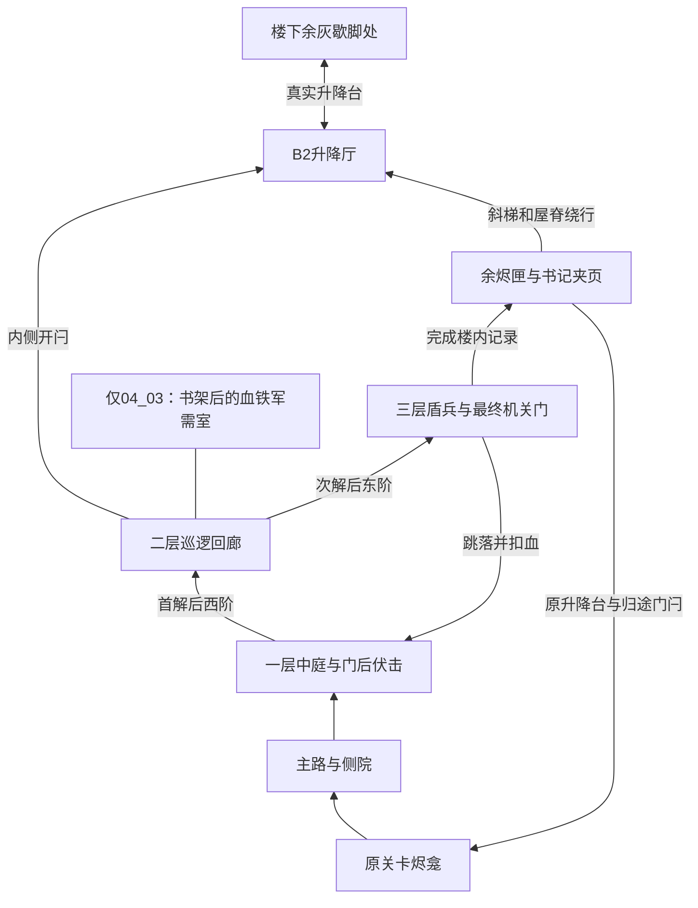

# 多层关卡：回路、威胁与遗事

本轮把扩展支线改为有可见目的地、逐层战斗压力和死亡回路的三层建筑。三道机关按发现、校对、归还的逻辑顺序推进，已打开的楼层允许回访。玉障`03_02`特意把最后的归名房放回一层；其余20栋的调查点逐层上行。碑文是补充解释，解开机关不再要求先读取文本。

叙事依据 [五章因果桥接图](../../story/chapter-bridge-map.md)、[主线](../../story/main-story.md) 和 [世界观](../../story/lore.md)。覆盖21个非Boss关卡；8个Boss前区保留外部眺望与准备空间。新增支线不替代主线事件和大型真相任务。

## 首次到访与再次到访

以下分钟段是设计节奏目标，尚不是玩家实测时长。

| 阶段 | 玩家看到什么、承受什么 | 为什么继续或回头 |
|---|---|---|
| 入楼约0–2分钟 | 同一平面叠起三层，层间高6米；中庭缺口露出实际顶层机关门，金色吊灯和新石门楣标出目的地。门后守兵给出拖刃声和短暂预警。 | 先确认上层可以到达，再决定处理守兵或拉开距离。 |
| 一层约2–5分钟 | 旧主人旁的刻印，经孔片或镜面连到接收石；控制台刻着三种不同形状。碑文解释死者留下的工作。 | 观察环境可直接操作；读碑补足人物处境。开启西阶后仍能返回检查遗漏。 |
| 二层约5–8分钟 | 北回廊有横向巡逻兵；巡逻室内侧可拉开B2门闩，接通楼下升降厅的余灰歇脚处。 | 先开门闩就是保存一段空间进度。失败后不用重走一层调查和西阶。 |
| 三层约8–12分钟 | 档室盾兵正面减伤，出招收势和背后暴露；中廊缺口能看见一楼散书落点。 | 消耗资源突破，或承担落伤撤回一楼；低血量时跳落仍会致命。 |
| 终点约12–15分钟 | 门后固定放置余烬匣、与本地官录矛盾的书记夹页、通往屋脊的斜梯。 | 取收益、保留疑问，再选择原归途升降台或屋顶绕行。 |
| 死后与补漏 | 已开机关门与B2门闩保持开启，普通守兵复位，携带余烬落入原有可回收残响。 | 从已赢得的歇脚处重返二层，追讨余烬、重新选择巡逻窗口或回看下层线索。 |

“顺序”约束三项调查的依赖关系，不禁止走回已经去过的地方。已开回路不重新收费，也不要求重复答题；跳落和屋顶回路重新利用同一中庭视角。一层还保留独立可翻检的遗物，漏看后可沿短回路再来。

门A距首块碑记约10米，保持直视门洞的视线，设计预算不超过15步。坡道尽头、一层中庭和二层瞭望位均对准实际顶层门；门上有金色吊灯、双面旗幡和新石门楣。二层前廊开有带护栏的光井，让坡道视线穿过真实楼板缺口。三种照明条件用于检查同一地标，不能用换成另一个标记的办法通过验收。



## 三张威胁卡

| 楼层 | 实际行为 | 玩家可读的应对 | 死亡与回路价值 |
|---|---|---|---|
| 一层：门后伏击 | 使用本章已有士兵或亡魂，藏在西阶门内侧；门A开启后才允许触发。近身并取得视线后先警示0.85秒，再释放追击；攻击前摇至少0.7秒。 | 声音、站位和预警先于攻击，门口留出退避距离，可引到宽处。 | 死亡重新布置伏击；开B2后可绕过这一段。 |
| 二层：回廊巡逻 | 真实导航巡逻，横穿北回廊；进入警戒范围后追击，脱离后返岗。 | 等巡逻经过、背后接近或退回已清房间；解谜不暂停敌人。 | 门闩从巡逻室一侧开启；重试点在楼下局部升降厅。 |
| 三层：档室盾兵 | 正面防御姿态减伤85%；背后、不可格挡攻击和攻击收势阶段正常受伤。首次开启顶层门必须解开对应机关并击败盾兵。 | 绕侧、诱导挥击后反击，或向书堆撤退。 | 失败保留已开门，复位守兵不会重新锁门；跳落以血量换取脱离，不消耗任务物品。 |

守兵加入原有敌人、掉落余烬和死亡复位系统，卸载关卡时回收。`05_01`的**新增侧路与楼内**不生成敌人，作为喘息段；原关卡已有配置未在本轮删除，因此不把整个`05_01`宣称为无敌关卡。

## 二层短回路与三层撤退

B2门闩位于巡逻室内侧，存档键按关卡隔离为`<level_id>/door_b2_latch`。初次从楼外一侧不能开闩。开闩点亮局部余灰歇脚处并保存重生位置；真正靠近火堆休息才回血和复位敌人。之后也可回原烬龛休息，主动更换重生点。

20秒预算的起点是**已经赢得的楼下余灰歇脚处**，终点为二层回廊入口，不是远处的原关卡烬龛。路线包括步行至升降厅、呼叫并登台、真实上升6米、穿过保持开启的门闩。平台单程3秒；实测必须包含呼叫、登台、出门，不能仅计算直线距离。

三层跳落口位于中廊，下方是一层中庭散书。实际约12米落差，落在书堆的基础落伤约10.8，硬地约36，仍受原有减伤系统影响；翻滚无敌帧不能抹去这次落伤。没有传送或落地自动满血。屋顶有实体斜梯、屋脊步道及下降坡段，绕至B2后侧平台，提供较长但无需跳落的第二出口。

## 环境解法与道具归属

每层有两段可见因果关系：**光源／刻印→孔片或斜镜→接收石**。接收石形状和颜色对应一座控制台。圆环、三角、方形各不相同，颜色不是唯一辨别手段；不同关卡和楼层改变对应位置。无需读字即可沿连接关系匹配，碑文解释同一个正确选项在遗事中的含义。错误选项不封死后续选择。

可选读碑另有侦察收益：记录`<level_id>/stele_scouted`，门A开启时照亮碑记房右侧书架后的凿痕复制品10秒；已经开门再读碑也可领取这一次提示。消耗标记先保存再显示，重复读取或读档不会无限刷新。原东墙凿痕常驻，因此错过这10秒也不影响解谜。

每件新增故事道具必须登记三项：**死亡者姿态／物品归属／指向下一房间的视线**。场景用倾垂遗留者、掉落印具、朝向门洞的刻痕呈现。逐物`object_lore`中的`belongs_to`、`dead_owner_pose`、`looks_toward`防止后续摆件脱离叙事，不能替代画面验收。

| 场景例子 | 主人及遗物 | 为什么在这里、指向什么 |
|---|---|---|
| `01_02`守门匠的末班 | 末班守门匠倾垂在检修线索旁；壁上火道记录、守灯器和掉落印具 | 属于最后一次巡检，指向下一段门链；恢复职责经过，不新增主线真相。 |
| `02_03`锤柄内的名字 | 失名锻工、扣押副册、军议桌与锁链 | 双份催工单说明同一双手被两军驱使；保留姓名和强征记录，不替代实际解救铁心。 |
| `03_03`空轿的送行帖 | 送行客、记忆镜、婚仪灯 | 空轿送的是旧愿；记忆属于原主人，玩家以见证者归还署名，不恢复虚构的“主角童年”。 |
| `04_03`缺页的借阅凭 | 抄书人、缺页、副本和原封借阅号 | 面向原卷通道；不提前揭示被删三行和完整天界实录。 |
| `05_01`岸边无人催行 | 留灯人、失物与空白登记位 | 断梳仍待原主，灯放在来路边；不替来者决定去处。 |

`04_03`刻意打破三连：二层书架后的侧室采用血铁军需陈设，赤旗、带小旗的军议桌、押运人与收存人的入库函出现在天界藏经阁。函件说收到血铁封箱，馆录却称未收外域兵械。玩家可偏离本层解谜进入这间实际房间再返回；函件保留矛盾，不替主线裁定幕后发令者。

`03_02`是唯一设置`chamber_violation=true`的归名房变体：借忆辨名室（一层）→记忆校对阁（二层）→三层发现空镜框、处理挡门盾兵→沿已开的楼梯回到一层守门灯阁的归名月室→回三层最终门。挂镜面向上行楼梯，机关顺序仍是0→1→2，实体路线发生折返。需求原句的“第二章玩家”与玉障所属第三章冲突，此处按`docs/story`的第三章归属实现。

具体摆件关系：靠窗遗留者手握守灯记录，面朝东墙凿痕；军议桌正中插小旗，折杆指向账房机关；归名镜挂在灯阁，反射上行方向；缺页书案的撕边与下室封蜡同色；登记书案的未干笔尖指向下一扇门。

## 顶层三件固定物

1. **一枚余烬**：顶层档室一个固定拾取点，一次增加1余烬，完成三项记录后领取。发光点放在实际奖励位置，采用约1.7米高的灯芯；玩家在最终门框东侧可透过中庭窗口目认，保留原有完整护栏。
2. **书记夹页**：放在余烬旁。五章分别矛盾于院墙完备、全员归营、自愿留忆、从未删卷和来者皆渡等本地说法；完成调查可留下本地批注，第五章可核对前章批注。它保留两种证词，不自动裁定正史、Boss选择或隐藏结局。
3. **屋脊斜梯**：以`roof_ladder_id`登记，档室后的实际可行走出口，接屋顶回路与B2平台。原归途升降台及回原烬龛门闩仍要求楼内记录完成。

## 三张体验指标卡

指标来自互动游玩事件，自动化检查不进入玩家统计。当前没有正式玩家样本，以下是目标和测试办法，不能写成已达标。

| 指标卡 | 记录方式 | 首轮目标与判退条件 |
|---|---|---|
| 解谜时间中位数 | 首次踏上本层至解开，含战斗、死亡等待；缺失进入事件的读档样本排除。按关卡、楼层及总样本数报告。 | 每层45–150秒。超过上限须区分找不到路、战斗压制、线索误解，再调整对应场景。 |
| 不读碑解开比例 | 解开前是否读取本层碑；配合口述，区分观察推理和碰运气。 | 初始目标≥50%能不读碑并解释两段关系；单独“没读过碑”事件不能证明理解。 |
| 首轮死亡位置热力图 | 首次完成整楼前，按楼层和6米网格记录死亡坐标；标注威胁及跳落区。 | 至少20名首次到访玩家；死亡占比暂定一层15–30%、二层25–40%、三层35–55%。安全火堆周围不得出现复生后即时击杀。零死亡和小样本不证明合格。 |

附加视线门槛：普通首次玩家在未读碑的前30秒内辨识环境线索，目标≥80%；从大厅、二层瞭望台、坡道尽头拍摄阴天／正午／黄昏三种照明条件，核对顶层门地标。截图和无遮挡射线只验证显示条件，识别率仍需人测。死亡样本若出现三层低于二层，须复核巡逻路线和盾兵耐力；归名房变体按真实死亡楼层归类，不能按第几个机关假定楼层。

本地日志：`user://playtests/interior-events.jsonl`。仅记录关卡、进度、位置和时间，不发送到外部服务。

```powershell
python tools/analyze_interior_playtest.py <interior-events.jsonl路径> --output build/scene-expansion/player-metrics
```

输出`metrics.md`和`death-heatmap.svg`。没有玩家样本时明确显示“未测”。体验门槛与工程回归分开，不能用合同项数量替代。

## 工程与验证附录

楼层与回路由室内布局生成；室内运行时持有交互、守兵、门闩和落伤；世界负责存档、重生与实体升降台。五章建筑继续使用Three.js导出的GLB，保留共享材质与批次；地形、坡道、门和平台有实际碰撞，导航使用简化建筑代理。

允许修改本楼墙体、开孔、回廊和敌对单位组；`interior_expansion_mods_v2`汇总凿痕、单向门、光井和挂镜变体，`interior_pressure`独立登记威胁。原主线关键路径锚点仍用于衔接，不能再以“原状保留”为由禁止本轮明确要求的空间修改。

已验证29关真实导航；三层门禁、可选读碑、保存失败回滚、死亡掉烬与守兵复位、真实自由落体和减伤。五章代表关卡完成B2连续回路，含呼叫空平台的回楼时间约10.9秒；玉障变体实际走到三层盾兵前，再回一层归名。另对遗物、侦察副本、固定1余烬和批注执行实际行走及生产交互检查。结果、画面与测试条件详见[需求落实与验证记录](02-environment-requirement-closure.md)。

所有自动化存档隔离到内存；直接选关、观察点放置、冻结AI路段单独标明，不能据此声称玩家通关全战役。`build/scene-expansion/`保存本地证据，受Git忽略，不代表已经导出或发布新浏览器版本。人工体验指标尚未验证。
