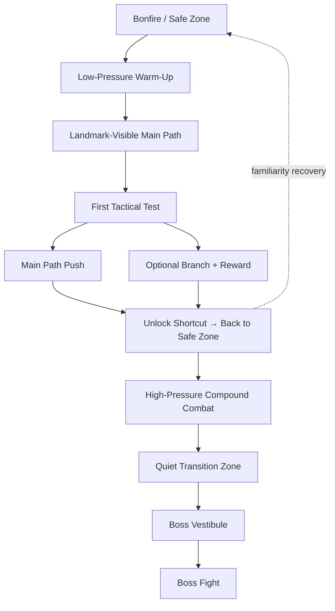

# Research — GitHub & Godot Souls-like Ecosystem

**Date:** 2026-07-30
**Status:** `ACTIVE` — research complete; implementation recommendations provided
**See also:** [`research-dark-souls-design.md`](research-dark-souls-design.md) — 12-topic DS design audit, vertical slice checklist
**See also:** [`research-dark-souls-weapons.md`](research-dark-souls-weapons.md) — per-style weapon tuning, hit-stop, hyper armor
**See also:** [`research.md`](research.md) — original soulslike vertical slice research, Godot API mapping

Research conducted 2026-07-30 to survey the Godot Souls-like ecosystem: GitHub repositories, Godot Asset Library templates, Dark Souls design methodology, and implementation patterns relevant to the Ashen Hollow vertical slice.

---

## Source Reliability Disclaimer

This report uses a three-tier evidence classification:

| Label | Criteria |
|---|---|
| **Observable rule** | Verifiable through GitHub repository contents, Godot Asset Library listings, Godot official documentation, or published interviews. |
| **Developer intent** | Requires named developer quotation from a datable, accessible interview, talk, or official publication. |
| **Analysis** | Interpretation built from observable artifacts. Must be labeled as analysis. |

Perplexity deep research and web search were used for discovery. Repository metrics (stars, forks, issues) were observed via GitHub pages and may have shifted slightly since access. All code examples are original synthesis based on observed patterns across multiple repositories and Godot official documentation — they are not copied from any single source.

---

## 1. Executive Summary

Two research lines ran in parallel: **source code and template ecosystem** (GitHub repositories and Godot Asset Library entries explicitly labeled Souls-like) and **original design methodology** (why Dark Souls feels like Dark Souls, and how to decompose that into reusable Godot modules).

The Godot Asset Library's most directly reusable Souls-like assets center on **catprisbrey's two templates**. GitHub mirrors these templates, adds a Godot 3/4 controller, BreadbinEngine, NovemberDev's 3D clone tutorial sample, and a small number of 2D Godot/C# prototypes. English-language repositories dominate; Chinese-language resources lean toward tutorials, commentary, and implementation videos rather than high-star, maintained public repositories.

From the original design side, Dark Souls' core is not "pure difficulty" but **learnable fairness**, **high-risk/high-reward decision structures**, **spatial surprise through shortcuts and loops**, **enemy and boss challenge driven by behavioral patterns rather than numerical inflation**, and **narrative embedded in space, item descriptions, and player observation**. Miyazaki's Dark Souls Design Works interviews repeatedly emphasize that areas were not built art-first then filled with gameplay, but rather started as rough maps establishing "structure, requirements, and atmosphere," then refined collaboratively by designers and artists.

For Godot developers, the most reliable path is not building a "complete Souls-like" upfront, but decomposing the system into seven loosely coupled layers: **character movement, animation and root motion, weapons and frame data, collision/hit detection, stamina/poise/guard-break, enemy/boss AI, and level design with the death-recovery loop**. Godot's official documentation provides the core building blocks: `CharacterBody3D` for controllable movement, `AnimationTree` / `AnimationNodeStateMachine` with root motion APIs for action choreography, `Area3D` / `RayCast3D` / shape queries for hit detection, `NavigationAgent3D` and signals for enemy AI and low-coupling communication, and `Resource` for data assets like weapons, movesets, and boss configurations.

### Assumptions

Target platform, team size, budget, and timeline were not specified. This report defaults to: **PC/controller-first, single-player, vertical-slice-first**. Team-size recommendations appear in Section 9.

---

## 2. Search Scope and Method

Four source categories were searched:

1. **GitHub repository pages** — descriptions, feature scope, stars/forks/issues, commit history, README implementation details.
2. **GitHub issues** — often expose real-world maturity on edge cases (attack chaining, lock-on, state transitions, root motion displacement, import compatibility) better than READMEs.
3. **Godot Asset Library** — confirms engine version, license, release date, and official listing status.
4. **Godot official documentation, original design interviews, and academic sources** — support design rationale and implementation paths, not just repository listings.

Keywords used: `soulslike godot`, `souls-like controller godot`, `dark souls clone godot`, `godot 4 souls-like template`, `Dark Souls design works interview`, `godot behavior tree`, and Chinese equivalents `Godot 类魂`, `Godot 魂类 状态机`, `GitHub 类魂 Godot 中文`.

Repository selection priority: **official-channel cross-verifiable** > **Godot 4 over Godot 3** > **stars/forks/issues show community use** > **README clearly exposes implementation boundaries** > **module reusability**.

---

## 3. Dark Souls Core Design Principles

The following table translates Dark Souls design principles into **design intent** and **implementation requirements** — actionable for a Godot project.

| Design Principle | Design Intent | Implementation Requirements |
|---|---|---|
| Difficulty curve is not linear stat inflation | Dark Souls is famous for difficulty, but mature analysis frames it as "hard but fair": early game is often most punishing because the player hasn't learned the rules yet, not because enemy stats are extreme. As the player learns roll timing, positioning, stamina management, and enemy rhythm, subjective difficulty drops. | Use **behavioral complexity** instead of pure numerical inflation. Place high-pressure gatekeeper enemies in visible positions as spatial signals of "you may not be ready yet." Never let enemies cheat via instant turns, zero-telegraph attacks, or distorted collision boxes. |
| Risk and reward are bound in the same loop | Exploring hidden areas, collecting drops, and pushing forward all yield rewards, but death exposes a full run's gains to risk. This makes "keep going" a strategic question, not just holding forward. | Every high-value area must pair with **perceptible danger**: tougher enemies, narrow terrain, ranged pressure, fall risk, or long engagement chains. The reward must be equally clear: shortcuts, rare weapons, upgrade materials, or knowledge gains. |
| Combat is measured, not mashable | Good Souls combat emphasizes action weight, wind-up/recovery, positioning, rhythm, and stamina. Both player and enemies operate under similar rules. Game Wisdom's formulation: neither side should slide into Hack and Slash territory. | Define startup, active, recovery, displacement, hitbox, stamina cost, cancellable windows, and input buffer per action. Weapon differences come from action shape and risk structure, not pure DPS. Heavy weapons must be slow but compensated with higher interrupt, guard-break, or spatial payoff. |
| World interconnection is emotional design, not technical flex | Miyazaki stated in interviews that many areas were first roughed out as maps determining structure, then art and function grew together. Some areas "connect in every direction," and elevators, waterwheels, loops, and shortcuts produce intense relief when a fatigued player suddenly returns to familiar safety. Anor Londo was explicitly treated as the mid-game emotional peak. | Design maps as **main path + several looping shortcuts + optional branches**. Shortcuts are not just time-savers; they fold the unfamiliar back into the familiar, helping the player re-locate themselves in the world. Major landmarks, elevators, bridges, and vertical reconnection points all carry cognitive-map functions. |
| Enemy and boss challenge comes from behavior, not cheating | Analyses of Dark Souls consistently emphasize that enemies are difficult because their behaviors test the player, not because of frame-reading, teleportation, or rule exemptions. Bosses are unique tactical problems built atop the same rules as regular enemies, not "bigger, thicker trash mobs." | Regular enemies are built around distance, facing, openings, and group positioning. Bosses need clearly readable phase structure, attack rhythm, spatial push-pull, positioning punishment, and opportunity windows. Do not just make them large with high HP — build **read → react → greed-management** loops. |
| Learning curve depends on "observe → trial → correct" | Academic analysis characterizes Dark Souls as a "sequential decision + iterative learning" system: failure reduces uncertainty, gradually converting unknown enemies, routes, and mechanics into predictable patterns. | New enemies should give the player observation time on first encounter. A boss's first-round moves should communicate core grammar. Death penalty must be real, but the return-to-combat time cannot be so long that learning is diluted by traversal. |
| Resource management is behavioral boundaries, not just numbers | In Dark Souls' reward structure, "resources" include health, currency, time, position, and emotional tolerance — not just HP and stamina. The stamina bar, heal count, consumables, and spell casts all shape whether the player can keep pressure, greed for hits, or must retreat. | Make stamina compete genuinely across attack / defend / dodge / sprint. Healing must have clear wind-up and risk exposure. Consumables should not substitute for core combat judgment, but should amplify style differences within builds or specific tactics. |
| Narrative makes the player a participant, not a recipient | IntechOpen's narrative analysis notes that Dark Souls tells its story primarily through environment, spatial suggestion, item descriptions, and sparse cutscenes — not dialogue dumps. The player is forced into the role of archivist/archaeologist, actively assembling meaning from fragments. The Guardian's Miyazaki interview traces this approach to his childhood experience of reading foreign-language novels by filling gaps with imagination from illustrations. | Distribute narrative material across **corpse placement, architecture state, enemy types, object arrangement, shortcut semantics, item text, and NPC dialogue deviation**. Truly important information should not exist only in UI text — it should be carried by the space itself. |
| Rhythm design must follow "pressure → release → pressure" | Anor Londo was described in interviews as a zone meant to make the player feel "I've finally arrived," showing that Dark Souls levels are not continuous high pressure — they orchestrate fatigue, alarm, recovery, and grandeur in sequence. | Within each major level: warm-up section, exploration section, ambush section, shortcut unlock, quiet space, boss vestibule. Sustained high pressure numbs the player; without recovery segments, achievement cannot be amplified. |
| Replay value comes from build, path, and knowledge sharing | Dark Souls' replayability is not just NG+ stat scaling — it comes from weapon style, stat build, different routes, optional areas, and the continuous exchange of community knowledge. Academically, this is characterized as "meta-learning and shared knowledge" jointly driving difficulty dissolution and sustainable engagement. | Systems must support **different weapon types, different damage dimensions, different growth curves, different area entry orders**. Levels must allow players to reconstruct routes based on equipment, skill, or information gaps. |

Compressed into one development maxim: **Don't replicate the suffering aesthetic — replicate the learnable space-combat-resource coupling.** This is why many Souls-likes copy rolling, soul drops, and bonfires but fail to feel like Dark Souls.

---

## 4. Level Design Patterns

Dark Souls level design is not just "complex maps." It bundles spatial cognition, enemy distribution, shortcut loops, narrative suggestion, and emotional rhythm together. Miyazaki explicitly stated in Design Works that many areas started as rough maps communicating "requirements, structure, and appearance" to artists — meaning level design in the original was always a framework layer, not post-decoration.

### Five Reusable Principles

1. **The main path must be clear but not look like a corridor.** Guide through landmarks, light, verticality, distant architecture, enemy facing, and pickup placement — not arrows or quest markers. Blighttown's waterwheel, elevator, and sinking descent visualize "going deeper" spatially.

2. **Shortcuts must rewrite the player's mental map.** A truly good shortcut is not "saves 30 seconds" — it's "this place and that place are in the same world." It converts pressure into mastery through spatial folding.

3. **Enemy placement carries teaching duty.** Placing enemies at corners, narrow bridges, stairways, behind doors, on ranged high ground, and in blind spots teaches observation, shield response, corner-cutting, pulling, and formation-breaking — not just ambush punishment.

4. **Rhythm must be segmented.** Safe zone, warm-up segment, exploration segment, surprise/ambush segment, shortcut unlock, boss silence, boss fight — this structure amplifies both pressure and achievement simultaneously.

5. **Levels must tell stories.** Why is this enemy here? Why are objects arranged this way? Why does this corpse face that direction? Why is this item on an edge or altar? These all constitute narrative, not just art decoration.

### Four Layout Patterns

| Pattern | Usage | Problem It Solves |
|---|---|---|
| Ring loop | From bonfire, through combat points, reconnecting at a high elevator, door latch, or ladder back to start. | Strengthens world interconnection, reduces repeat traversal, creates "I was above here the whole time" surprise. |
| Hub-and-spoke | A safe zone or atrium anchors several branches of varying pressure. | Allows the player to switch routes when blocked, maintaining exploration agency over pure linear push. |
| Vertical stack | Upper layer for sight-line guidance and ranged pressure, lower layer for melee and fall risk, connected by ladders/waterwheels/elevators. | High-density exploration and spatial memory in limited footprint. |
| Boss vestibule | A relatively calm space before the boss door for recovery, observation, and build adjustment. | Separates "learning the boss" from "being worn down by trash mobs on the way," improving perceived fairness. |

### Typical Souls-like Level Skeleton

The following topology is not a replica of any specific original map — it is a general skeleton suitable for a Godot vertical slice, derived from Dark Souls' rough-map collaboration approach, shortcut logic, and the principle that boss learning must not be diluted by long runbacks.



### Enemy Placement Strategy

The most effective strategy is not stacking numbers — it's using **combinations to create problems**. Examples: a melee enemy forces the player backward while a ranged enemy on high ground seals the retreat route; a slow, space-controlling elite occupies the room while two small enemies disrupt rhythm; a narrow-corridor shield enemy forces the player to circle around, exposing them to a flanking thrust enemy. This fits Souls' core: difficulty comes from situational judgment, not pure reaction speed.

### Sight-line and Exploration Guidance

Use a three-layer structure: **distant landmark** (tells the player "that's where I'm going"), **mid-range threat** (creates cautious advance), **close-range reward** (lures branch exploration). Don't put glowing chests at every corner. Don't put every good item on the main path center-line. Souls-like exploration pleasure comes from the player interpreting risk as opportunity themselves.

---

## 5. Godot System Implementation

If you're building a credible Souls-like prototype in Godot, the highest priority is not writing boss AI first — it's **decoupling data, action, and hit detection**. Godot's official documentation points to `AnimationTree` as the animation transition control center, `CharacterBody3D` for high-level character movement, `Area3D` and spatial queries for hit detection, signals for low-coupling inter-object communication, and `Resource` as the natural data carrier for weapons, movesets, and enemy configurations. These principles align closely with catprisbrey's template philosophy of "signals + loose code + animation library."

### Recommended Architecture

| Module | Recommended Data Structure | Key Godot Nodes / APIs | Implementation Focus |
|---|---|---|---|
| Character movement | `CharacterController` + `MovementConfig` | `CharacterBody3D`, `move_and_slide()` | Separate free-run, lock-on strafe, sprint, dodge, hit-reaction displacement. Don't hardcode attack displacement — prefer coordination with animation displacement. |
| Animation & state | `AnimationState`, input buffer queue | `AnimationTree`, `AnimationNodeStateMachine`, transition conditions | Unified management of Idle/Move/Dodge/Attack/Hit/Stun/Death. Allow input buffering but strictly control cancellable windows. |
| Root motion | `RootMotionPolicy` | `AnimationTree` / `AnimationMixer.get_root_motion_position()`, `get_root_motion_rotation()`, `RootMotionView` | Attacks, dodges, finishers — high-expression actions prefer root motion. General navigation running can be code-driven. |
| Hit detection | `AttackDef`, `HitboxScene` | `Area3D`, `RayCast3D`, `PhysicsDirectSpaceState3D.intersect_shape()` | Melee: "activation window + deduplicated hit list." Long-handle weapons: add forward shape query to reduce misses. |
| Weapons & movesets | `WeaponData`, `AttackChain`, `DamageProfile` | `Resource`, `ResourceLoader` | Weapons are data, not code branches. Write action names, damage multipliers, stamina costs, and interrupt values into resources. |
| Stamina / poise / guard-break | `StatsComponent`, `PoiseComponent` | `Timer` / `SceneTreeTimer`, signals | Attacks, blocks, and dodges share one stamina pool. Poise and guard-break must be able to interrupt the state machine, subject to hyper-armor/poise control. |
| Enemy & boss AI | `Perception` + `Decision` + `Action` three-layer | `NavigationAgent3D`, state pattern, BT/SM plugins like LimboAI or Beehave | Recommend "macro behavior tree + micro combat state machine" hybrid: BT handles pursuit/disengage/circle, FSM handles one attack's full lifecycle. |
| Low-coupling communication | `CombatEvents`, `TargetEvents` | Signals | Hits, deaths, target switches, stamina depletion, boss phase transitions — all broadcast via events, not chained `get_node()` calls. |

### Weapons and Moveset Data

The following GDScript is not copied from any single repository — it synthesizes Godot's `Resource` data-container pattern with BreadbinEngine's "moveset driven by string-array animation names" approach. The benefit: designers edit resource files directly; programmers maintain one combat executor.

```gdscript
# weapon_data.gd
class_name WeaponData
extends Resource

@export var weapon_id: StringName
@export var display_name: String
@export var stamina_cost_light: float = 18.0
@export var stamina_cost_heavy: float = 32.0
@export var damage_physical: int = 100
@export var damage_fire: int = 0
@export var block_guard_damage: int = 25
@export var poise_damage: float = 20.0

# Each action is one AttackDef; maps to AnimationTree state name or AnimationLibrary animation name
@export var light_chain: Array[AttackDef]
@export var heavy_chain: Array[AttackDef]
@export var roll_attack: AttackDef
@export var running_attack: AttackDef


# attack_def.gd
class_name AttackDef
extends Resource

@export var anim_state: StringName
@export var startup_sec: float = 0.18
@export var active_sec: float = 0.10
@export var recovery_sec: float = 0.35
@export var hitbox_scene: PackedScene
@export var motion_scale: float = 1.0
@export var can_chain_on_hit: bool = true
@export var can_chain_on_block: bool = false
@export var i_frame_begin_sec: float = -1.0  # -1 = no i-frames
@export var i_frame_end_sec: float = -1.0
```

This data should cover at minimum: **action name, startup, active, recovery, stamina cost, damage multiplier, guard-break value, poise damage, displacement multiplier, input buffer window, whether chaining is allowed**. Without these fields, Souls-like combat quickly degenerates into "play animation + subtract HP." With them, light, heavy, running attack, roll attack, jump slash, charged, and parry-riposte all flow through one unified pipeline.

### Hit Detection, Stamina, and Input Buffering

Godot's `Area3D` suits melee hitboxes naturally — it supports enter/exit/overlap detection. Sweeping weapons can layer `intersect_shape()` or `RayCast3D` for compensation hits. Timer / SceneTreeTimer suits i-frame windows, recovery windows, and stamina regeneration delay.

```gdscript
# Melee attack executor (simplified)
var already_hit: Dictionary = {}
var stamina: float = 100.0
var stamina_regen_cooldown := 0.0

func perform_attack(def: AttackDef, weapon: WeaponData) -> void:
    if stamina < weapon.stamina_cost_light:
        return

    stamina -= weapon.stamina_cost_light
    stamina_regen_cooldown = 0.6

    anim_tree["parameters/playback"].travel(def.anim_state)

    await get_tree().create_timer(def.startup_sec).timeout
    _open_hitbox(def)

    await get_tree().create_timer(def.active_sec).timeout
    _close_hitbox()

    await get_tree().create_timer(def.recovery_sec).timeout
    emit_signal("attack_recovered")

func _open_hitbox(def: AttackDef) -> void:
    already_hit.clear()
    var hb := def.hitbox_scene.instantiate()
    hb.body_entered.connect(_on_hitbox_body_entered)
    $Hitboxes.add_child(hb)

func _close_hitbox() -> void:
    for c in $Hitboxes.get_children():
        c.queue_free()

func _on_hitbox_body_entered(body: Node) -> void:
    if already_hit.has(body):
        return
    already_hit[body] = true
    body.call_deferred("apply_hit", {
        "damage": 100,
        "poise_damage": 20.0,
        "guard_damage": 25
    })

func _physics_process(delta: float) -> void:
    if stamina_regen_cooldown > 0.0:
        stamina_regen_cooldown -= delta
    else:
        stamina = min(100.0, stamina + 30.0 * delta)
```

Three critical points: (1) **deduplicate per-swing**, otherwise multi-frame overlaps count as multiple hits; (2) **stamina regeneration must delay after spending**, otherwise the player always tends toward mindless rolling or light-attack spam; (3) **attack recovery events must be explicitly emitted**, letting the state machine decide whether to chain or return to neutral. True Souls-like feel often comes not from more complex inputs but from stricter "when you cannot act."

### Boss AI and Phase Control

Don't solve boss AI with one giant state machine. In Godot, the more stable approach: **navigation / positioning / pursuit / disengage** use a behavior tree or upper decision state; **individual attack lifecycle** uses a local state machine. Godot has no built-in full BT editor, but the Asset Library and GitHub ecosystem offer mature solutions like LimboAI (Behavior Trees + State Machines) and Beehave (3k+ GitHub stars, community-validated for complex NPC and boss behaviors).

```gdscript
# boss_brain.gd (pseudocode)
enum Phase { PHASE_1, PHASE_2 }

var phase := Phase.PHASE_1
var cooldowns := {
    "slash_combo": 0.0,
    "gap_close": 0.0,
    "aoe_burst": 0.0
}

func decide_next_action(dist: float, player_healing: bool, my_hp_ratio: float) -> StringName:
    if my_hp_ratio < 0.5 and phase == Phase.PHASE_1:
        phase = Phase.PHASE_2
        return &"phase_transition"

    if player_healing and dist < 8.0 and cooldowns["gap_close"] <= 0.0:
        return &"gap_close"

    if dist < 2.5 and cooldowns["slash_combo"] <= 0.0:
        return &"slash_combo"

    if dist > 5.0 and cooldowns["gap_close"] <= 0.0:
        return &"gap_close"

    if phase == Phase.PHASE_2 and cooldowns["aoe_burst"] <= 0.0:
        return &"aoe_burst"

    return &"reposition"
```

The principle: **a boss's difficulty comes from conditional-response readability and timing pressure, not pure randomness.** When the player heals, the boss may lean toward gap-closing. When the player sticks too close, the boss leans toward melee combos or close-range AoE. Phase 2 doesn't just add damage — it introduces new spatial-forcing mechanics. This most closely matches Dark Souls' read-and-learn logic.

### Model and Animation Import

Godot's official `AnimationTree` and root motion documentation is critical: if you want attack footsteps, dodge distance, finisher alignment, and door-push force to match the animation, place that displacement in the root bone and extract it via `get_root_motion_position()` / `get_root_motion_rotation()`. Cat's template explicitly requires compatibility with Godot/Unity/Mixamo standard skeleton mapping — in the prototype phase, this dramatically reduces the cost of swapping models and animation libraries.

---

## 6. Representative Repository Comparison

The following table prioritizes **representativeness, reusability, and project risk** — not raw star count. Metrics marked "~" are approximate snapshots; at this granularity they are sufficient for selection decisions.

| Repository | Language / Engine | Scope | Metrics | Strengths | Limitations / Risks | Reusable Modules |
|---|---|---|---|---|---|---|
| `catprisbrey/Cats-Godot4-Modular-Souls-like-Template` | Godot 4.2; GDScript/scenes; signals + animation library driven | 3D Souls-like full-family template: root motion, main/offhand weapons, items, lock-on, knockback, block/perfect parry, dodge, sprint, ladders, interactions, enemy multi-state + pathfinding, ragdoll death, 110+ animations | ~400★ / 60+ forks / 3 open issues | Best current Godot 4 Souls-like prototype base; modules comprehensive, assets complete, low reuse barrier; README explicitly states goal of "swap models and animations without breaking logic" | README states v3.0 will fully rewrite old code; open issues already expose attack-chaining lockup, axe state lockup — indicating it's a prototype scaffold, not a debugged product | Player controller, AnimationTree architecture, lock-on, weapons/items, enemy states, interaction props, level graybox assets |
| `catprisbrey/Third-Person-Controller---Godot-Souls-like` | Godot 3.5; GDScript; exposes `PlayerTemplate.gd`, `CameraTemplate.gd` | 3D controller template: 360 camera, lock-on strafe, combos, special attacks, keyboard/mouse + gamepad | ~120★ / 21 forks / 0 issues | More focused structure, good for learning "minimum Souls-like controller" without being overwhelmed by the full template | Godot 3.5; if your project starts from Godot 4, migration cost is non-trivial | Third-person camera, input mapping, basic combos, AnimationTree integration workflow |
| `catprisbrey/Third-Person-Controller--SoulsLIke-Godot4` | Godot 4; GDScript; early port of the 3.5 template | Quick character model + animation tree hookup covering movement, dodge, combo attacks, basic camera | ~45★ / 8 forks / 0 issues / 12 commits | Fast Godot 4 start; good for those wanting just character control + camera reuse | Author labels it "Early/outdated port"; more migration example than mature base | CharacterBody3D-based controller, Godot 4 animation integration, minimal scene organization |
| `CornflakeWoof/BreadbinEngine` | Godot 4; clear script directory, GDScript workflow | 3D ARPG framework targeting Dark Souls / Bloodborne feel, emphasizing extensibility. Most valuable: soft-coded movesets and Inspector-tunable AI tendencies | 16★ / 0 forks / 0 issues / 8 commits | Good for studying data-driven weapon systems and tunable AI tendencies | Low community validation, few commits — more early framework experiment than multi-user template | Weapon resource / moveset table, configurable AI, data-driven ARPG thinking |
| `NovemberDev/novemberdev_soulslike_darksouls_godot` | Godot 3D project; tutorial companion sample | "How to make a 3D Dark Souls clone in Godot" video companion repo | ~70★ / 11 forks / 1 open issue | Intuitive, low barrier; good for seeing "what systems does a minimal Souls-like clone actually need" | Tutorial project; open issue still at basic function-error level — not your go-to base for content production | Minimal player-enemy-attack loop, tutorial-style decomposition path |
| `alex-musick/darksoulsclone-2d` | Godot .NET / C#; README states "Developed in Godot .NET and C#" | 2D Souls-like prototype, currently closer to mob horde fighting game, but demonstrates C# character, AI, and room organization | 1★ / 0 forks / 0 issues / 80 commits | If you prefer C# over GDScript, this repo is more instructive than most 2D Godot Souls-like samples | Limited completeness, weak community validation; better for 2D combat-loop experiments than canonical 3D Souls-like | C# Player / Mob layering, 2D moveset experiments, room prototype |
| `zakkor/dungeon` | Godot; top-down 2D | Top-down 2D souls-like — good for studying simplified risk-exploration-enemy-placement loops | Small community | Inspires 2D prototype thinking | Smaller community footprint; supplementary rather than primary reference | Simplified exploration loop, 2D enemy placement patterns |
| `SenZmaKi/gyattsouls` | Godot; 2D | Hybrid souls-like + metroidvania — good for studying weapon rhythm + path gating in 2D | Small community | Inspires 2D hybrid thinking | Smaller community footprint | Weapon rhythm + path-lock combination in 2D |

### Selection Summary

- **Fastest path to a working 3D Souls-like base:** Cat's Godot 4 template — most comprehensive, best-documented, most reusable.
- **Best for studying data-driven weapon systems:** BreadbinEngine — soft-coded moveset and AI tendency thinking.
- **Best for tutorial-style understanding:** NovemberDev — minimal clone, step-by-step.
- **Best for 2D Souls-like experiments:** `darksoulsclone-2d` and `dungeon`.
- **Godot 3 reference:** catprisbrey's Godot 3.5 controller template — focused and clean, but migration cost applies.

### Godot Asset Library Entries

Two entries are directly searchable and information-complete:

- **Godot 4 Souls-Like Template** (catprisbrey) — Godot 4.2, the Asset Library mirror of the GitHub repository above.
- **Third Person Controller Template -- Melee-Souls-Like** (catprisbrey) — Godot 3.4, the Asset Library mirror of the Godot 3 controller.

---

## 7. Reusable Module Checklist and Milestones

Since target platform, team size, budget, and timeline were not specified, the most reasonable approach is decomposing the Souls-like into a **priority-and-difficulty-graded reusable module checklist**. Order is: playable first, correct second, rich third. Don't touch large worlds, multiple bosses, complex narrative, or extensive build branches before the first two tiers are solid.

| Priority | Module | Difficulty | Rationale |
|---|---|---|---|
| **Must-do** | Player movement, camera, lock-on, basic dodge | Medium | This is the base on which Souls-like "feel" stands or falls. Without it, all subsequent combat tuning is distorted. Directly reference catprisbrey's two controller templates. |
| **Must-do** | Animation state machine, input buffering, hit-stun interrupts | High | Souls-like flavor comes from actions being non-cancellable, hits having feedback, inputs being bufferable but not mashable. Godot's `AnimationTree` / state machine is purpose-built for this. |
| **Must-do** | Weapon data, hit detection, damage/poise/stamina | High | Without this layer, it's just "slash once, subtract HP" — not a Souls-like. BreadbinEngine's soft-coded moveset thinking is highly reusable. |
| **Must-do** | One basic enemy + one elite enemy + one tutorial boss | High | Enemy behavior is a major source of Souls feel. At minimum, "trash → elite → boss" three tiers are needed before the learning curve is visible. |
| **Must-do** | One ring level + one shortcut + one boss vestibule | Medium | This is the minimum unit for putting "Souls-like spatial grammar" into the game. No shortcut and no loop-back means you're just making a third-person action level. |
| **Should-do** | Block / perfect parry / guard-break / poise | High | These systems expand combat from single-path to multi-path, determining the ceiling of high-level play. Cat's template already provides a solid prototype reference. |
| **Should-do** | Bonfire/save/respawn, dropped resource recovery | Medium | No failure loop = no risk-reward structure. |
| **Should-do** | Distant landmarks, environmental narrative, item text | Medium | This is the key step from "systems are correct" to "feels like Dark Souls." |
| **Could-do** | Multiple weapon types, multiple builds, optional branches | High | This is the replay-value layer; it significantly extends timeline. Expand only after the vertical slice is stable. |
| **Could-do** | AI behavior tree plugin integration | Medium | When enemy and boss counts grow, hand-written FSMs bloat quickly. LimboAI / Beehave are appropriate to import at this stage. |

### Team-Size Recommendations

**Solo developer:** Most suited to "existing template + one melee weapon + one elite + one boss + one ring level." Don't self-build a full AI editor, character modeling pipeline, or dozens of animation sets in phase one. What you truly need: take a mature Godot 4 template, get the animation tree, root motion, hit reactions, and level loop-back running, then build one weapon's complete frame data. For a solo dev, the most valuable thing is not "more content" but "fewer uncontrolled variables." Cat's template has an enormous advantage here.

**Small team:** Most suited to "programmer builds systems, artist supplies resources, designer tunes tables" — three-way split. The critical thing is resource-ifying all weapons, enemies, and bosses so the programmer doesn't touch the core state machine every time a new weapon is added. BreadbinEngine's soft-coded moveset thinking, Godot's `Resource` data containers, and Signals-based low-coupling communication are all very well-suited to 3–5 person scale.

**Mid-size team:** Only at this scale is it worth systematically building content pipelines: enemy families, weapon families, combat event bus, boss phase scripting, level graybox-to-art replacement, unified camera rules, unified landmark language, unified narrative placement conventions. Without establishing these "grammars" first, the most common mid-size-team failure mode is not "can't build it" but "every area feels like a different game." Miyazaki's Design Works emphasis on "rough map first + theme unity + individual artist style expressed within a unified framework" is especially important here.

### Rough Hour Estimates

Baseline: PC single-player, controller-first, vertical-slice-first. If you're building 3D characters, motion capture, audio, full narrative, and extensive scene assets from scratch, hours will significantly increase.

| Target Output | Solo Developer | Small Team | Mid-Size Team |
|---|---:|---:|---:|
| Playable prototype | 200–350 hrs | 300–600 total hrs | 500–900 total hrs |
| Vertical slice | 700–1200 hrs | 1200–2200 total hrs | 1800–3200 total hrs |
| First-chapter demo | 1500–2500 hrs | 3500–6000 total hrs | 8000–15000 total hrs |

These estimates assume: (1) maximize reuse of existing templates and public assets; (2) build one weapon set / one boss / one level grammar first, then expand. If you reverse — five weapon types, ten maps, seven bosses, massive narrative text first — you'll likely be crushed by content volume before the "Souls-like grammar" actually validates.

---

## 8. Godot Implementation Patterns — Three Categories

From the representative repositories, Godot Souls-like implementations fall into three categories:

### Category 1: Controller Templates

Examples: catprisbrey's Godot 3.5 and Godot 4 controllers.

**Strengths:** Fastest path to a running character + camera. Focused scope means less code to audit.

**Weaknesses:** Doesn't include weapon data systems, enemy AI, or level infrastructure. You bring those yourself.

**Best for:** Solo devs and small teams who want to start from a working character rather than from `CharacterBody3D` docs.

### Category 2: Modular Scaffolds

Examples: Cat's Godot 4 template.

**Strengths:** Lock-on, weapons, items, enemy states, pathfinding, ladders, parry, root motion all packaged as recombinable systems. Animation library with 110+ clips included.

**Weaknesses:** README warns of upcoming v3.0 rewrite. Open issues show edge cases (attack chain deadlock, axe state lockup). Treat as prototype scaffold, not a bug-free product.

**Best for:** Teams that want the full system landscape pre-wired and are willing to debug in exchange for massive time savings.

### Category 3: Data-Driven Frameworks

Examples: BreadbinEngine.

**Strengths:** Soft-coded movesets (animation names from string arrays, not hardcoded enum branches). AI tendencies tunable in Inspector. The thinking is the asset, even if the repo is small.

**Weaknesses:** Low community validation, few commits. Early experiment, not a multi-user template.

**Best for:** Teams that already have a controller and want to study how to data-drive weapons and AI without painting themselves into a corner.

### What You Should Actually Reuse

The data-driven and event-driven organization patterns — not any single repository's scene tree. Take Cat's template for the controller and system skeleton. Take BreadbinEngine's moveset-as-data thinking for weapon architecture. Take NovemberDev's tutorial for understanding the minimum set. Do not copy-paste a scene tree and call it your game.

---

## 9. Key Repository and Resource Links

### GitHub Repositories

- `catprisbrey/Cats-Godot4-Modular-Souls-like-Template` — primary Godot 4 base
- `catprisbrey/Third-Person-Controller---Godot-Souls-like` — Godot 3.5 controller
- `catprisbrey/Third-Person-Controller--SoulsLIke-Godot4` — Godot 4 early port
- `CornflakeWoof/BreadbinEngine` — data-driven moveset + AI framework
- `NovemberDev/novemberdev_soulslike_darksouls_godot` — tutorial companion
- `alex-musick/darksoulsclone-2d` — 2D Godot .NET / C# prototype
- `zakkor/dungeon` — top-down 2D souls-like
- `SenZmaKi/gyattsouls` — 2D souls-like + metroidvania hybrid

### Godot Asset Library

- **Godot 4 Souls-Like Template** (catprisbrey) — Godot 4.2
- **Third Person Controller Template -- Melee-Souls-Like** (catprisbrey) — Godot 3.4

### Godot Official Documentation

- `AnimationTree` — animation state machine and blending
- `CharacterBody3D` — script-driven 3D character movement
- `Area3D` — monitorable 3D regions for hit detection
- `NavigationAgent3D` — pathfinding and avoidance
- `Signals` — low-coupling inter-object communication
- `Resource` — data container for weapons, movesets, configs
- Root motion API — `get_root_motion_position()`, `get_root_motion_rotation()`, `RootMotionView`

### Design References

- Dark Souls Design Works interview translations — Miyazaki on level design collaboration, world structure, and atmosphere
- Academic analyses: Dark Souls risk-reward structures and environmental narrative
- Game Wisdom: combat design analysis — measured vs. mashable combat
- IntechOpen: narrative analysis of Dark Souls — player as archivist/archaeologist

---

## 10. Relevance to Ashen Hollow

### What Already Aligns

1. **Attack commitment (wind-up/active/recovery):** Ashen Hollow's three-phase model matches the ecosystem consensus on how Souls-like combat should be structured. This is the single most important correct decision.

2. **Stamina as shared budget:** Sprint, attack, dodge all drawing from one pool — matches DS design and every credible Godot template.

3. **Signals-based communication:** Ashen Hollow's use of Godot signals for combat events aligns with catprisbrey's template philosophy and official Godot best practices.

4. **Single vertical slice scope:** Ashen Hollow's 10–15 minute slice with one boss, one shortcut, one shrine matches the ecosystem recommendation of "prove the loop before expanding."

5. **Procedural-first approach:** Using procedural poses before importing animation — this validates state timing independently, which is the correct sequencing per the research.

### What Ashen Hollow Could Adopt

1. **Per-style weapon data resources:** Currently, all five combat styles use uniform timing and costs. The ecosystem research strongly recommends `Resource`-based per-style differentiation (see [`research-dark-souls-weapons.md`](research-dark-souls-weapons.md) for specific tuning targets).

2. **Root motion for key actions:** When animation imports arrive, attacks, dodges, and finishers should use root motion for displacement, with code-driven movement for general navigation. Godot's `get_root_motion_position()` API is the path.

3. **Data-driven enemy AI:** As enemy variety grows beyond the current Sentinel + Guardian, consider the BT+FSM hybrid pattern (LimboAI or Beehave) rather than expanding the monolithic enemy FSM.

4. **Boss decision hierarchy:** The Cinder Guardian could adopt the conditional-response pattern (Section 5, boss_brain.gd pseudocode) — distance-bracket attack selection, healing-punish tendency, phase-gated new mechanics.

5. **Shortcut as spatial rewrite:** The existing shortcut gate should demonstrably reduce shrine-to-boss traversal by ≥30% and create a "I was here above" spatial revelation — not just a time-saver.

### What Ashen Hollow Should NOT Adopt

- **Cat template wholesale replacement:** Ashen Hollow has its own architecture. Take patterns, not scene trees.
- **Exact stamina/damage numbers from any template or game:** These must be tuned against Ashen Hollow's own animation timings and enemy pressure.
- **Any specific map layout, boss design, or narrative from a protected work:** Genre conventions only.
- **BT plugins before the core loop works:** The current FSM is sufficient for the vertical slice. Add BT only when enemy count makes the FSM unmanageable.

---

## 11. Gaps and Open Questions

### Research Gaps

1. **No large-team Godot Souls-like postmortems found:** The ecosystem lacks published production postmortems from commercial Godot Souls-like projects. All representative repositories are solo or very-small-team efforts.

2. **Godot 4-specific Souls-like content is early:** The most mature template (Cat's) is pre-3.0 rewrite. BreadbinEngine is 8 commits. The ecosystem is active but young.

3. **C# Godot Souls-like examples are scarce:** Only `darksoulsclone-2d` was found with explicit .NET/C# usage. Teams preferring C# over GDScript have fewer reference points.

4. **No authoritative frame data source:** Community-sourced Dark Souls frame data varies by game version and patch. All timing numbers in this report are directional, not specifications.

5. **Chinese-language open-source Souls-like repos are sparse:** Chinese resources lean toward tutorials and commentary rather than maintained public repositories. The report's repository analysis is therefore English-ecosystem-weighted.

### Open Questions for Future Research

1. Has any team shipped a commercial Godot 4 Souls-like? If so, are there published postmortems or tech talks?
2. Are there Godot-specific animation retargeting workflows for Mixamo → Godot Humanoid Skeleton that the Souls-like community has standardized?
3. What is the performance ceiling of `NavigationAgent3D` with 20+ active enemies in Godot 4.7?
4. Has anyone published a Godot 4 behavior tree integration specifically tuned for Souls-like boss phase scripting?

---

## 12. Conclusion

If the goal is "build a credible Souls-like in Godot," the correct sequence is not "stack features first" but:

1. **Replicate fair action structure** — attack commitment, readable telegraphs, stamina as real constraint.
2. **Replicate looping level design** — ring topology, shortcut as spatial revelation, boss vestibule.
3. **Replicate observational learning** — enemy behaviors that teach through encounter, not tutorial text.
4. **Replicate fragmented narrative** — space, item text, enemy placement, and object arrangement as story.

Once these four hold, even a prototype with one sword, one boss, and one map will feel closer to Dark Souls' essence than many surface-level clones with rolling, bonfires, and soul drops.

The Godot ecosystem provides sufficient building blocks. The templates exist. The documentation is clear. The missing ingredient is not technology — it's the discipline to build the grammar before the vocabulary.

---

## Sources & Search Coverage

### Search Queries Executed

| Query | Mode | Result |
|---|---|---|
| `soulslike godot` + `souls-like controller godot` | GitHub repository search | ~12 candidate repos; 6 selected for detailed comparison |
| `Godot 4 Souls-Like Template` | Godot Asset Library | 2 official listings (Godot 4.2 and Godot 3.4) |
| `dark souls clone godot` | GitHub + web search | Tutorial and sample repos identified |
| `Dark Souls design works interview` | Web search + Perplexity | Design Works translation pages, Miyazaki quotes |
| `Godot 类魂` / `Godot 魂类 状态机` | Bilibili + CSDN + web search | Tutorial and commentary content; no high-star public repos |
| Godot official docs: `AnimationTree`, `CharacterBody3D`, `Area3D`, `NavigationAgent3D`, `Signals`, `Resource`, root motion | Godot docs | All claims verified against official documentation |
| `godot behavior tree` / `LimboAI` / `Beehave` | GitHub + Godot Asset Library | Plugin maturity and community validation assessed |

### Source Types Consulted

- GitHub repository pages, issues, and READMEs — observable metrics and feature scope
- Godot Asset Library listings — official engine version, license, release date
- Godot official documentation — API verification for all implementation recommendations
- Dark Souls Design Works interview translations — developer intent on level design and world structure
- Academic analyses (IntechOpen, peer-reviewed) — risk-reward structure and environmental narrative
- Game Wisdom and community analysis — combat design principles
- Bilibili, CSDN — Chinese-language tutorial and commentary ecosystem scan

### Search Limitations

- Repository metrics (stars, forks, issues) are snapshots and may have shifted since access.
- No commercial Godot 4 Souls-like postmortems were found — the ecosystem is early.
- Chinese-language open-source Souls-like repos are sparse; the analysis is English-ecosystem-weighted.
- Perplexity deep research provided design framework answers but limited direct source URLs for developer quotes. Design claims are labeled as Analysis where developer attribution is absent.
- All frame data, stamina costs, and timing numbers are directional community estimates — they must be tuned through playtesting, not copied verbatim.
