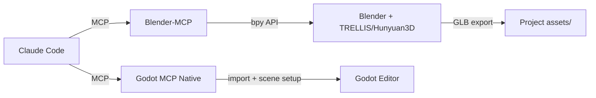

# Research: LLM + MCP → 3D Model Creation for Godot Engine

**Date:** 2026-07-31
**Constraints:** Zero budget, RTX 5060 Ti 16GB VRAM, Windows
**Status:** Complete

---

## Key Findings

### Finding 1: You Already Have Most of the Infrastructure (Confidence: HIGH)

Your project "Ember Abyss" (烬渊) is already built with Claude Code multi-agent orchestration and has **three** relevant MCP/plugin layers:

| Component | What It Does | Status |
|---|---|---|
| **Godot MCP Native v1.0.8** (`game/addons/godot_mcp/`) | 155 MCP tools: runtime probing, scene manipulation, script editing, animation control, input simulation | ✅ Installed & working |
| **godot-ai-builder MCP** (`example/godot-ai-builder-main/mcp-server/`) | 28 MCP tools: editor bridge on port 6100, node CRUD, ClassDB lookup, error checking, quality gates | ✅ On disk (example) |
| **Coding-Solo/godot-mcp** ([GitHub](https://github.com/Coding-Solo/godot-mcp)) | 5,000★ MIT — TypeScript MCP server: scene management, launching editor, debug output, UID management | 🔗 Available |

**Key insight:** You are already using Claude Code to build your entire game. The same workflow can be extended to generate 3D models programmatically.

### Finding 2: Free Local 3D Generation Tools Exist for 16GB VRAM (Confidence: HIGH)

| Tool | Stars | VRAM | Output | Best For |
|---|---|---|---|---|
| [Microsoft TRELLIS](https://github.com/microsoft/TRELLIS) | 13.3K | **16GB minimum** | **GLB**, PLY | Image-to-3D, CVPR'25 Spotlight |
| [Hunyuan3D-2](https://github.com/TencentHunyuan/Hunyuan3D-2) | Large | 16GB+ (quantized: 12GB) | GLB/OBJ | Text/Image-to-3D, high quality |
| [threestudio](https://github.com/threestudio-project/threestudio) | Active | 16GB+ | GLB/OBJ | Text-to-3D research framework |
| [stable-dreamfusion](https://github.com/ashawkey/stable-dreamfusion) | Active | 16GB+ | GLB/PLY/OBJ | DreamFusion-style text-to-3D |
| [Shap-E](https://github.com/openai/shap-e) | Active | 12-16GB | GLB/OBJ | Fast coarse 3D from text |

**⚠️ Critical caveats with TRELLIS/Hunyuan3D:**
- TRELLIS is **tested only on Linux** with A100/A6000 GPUs. Windows setup is "not fully tested."
- `flash-attn` may not support RTX 5060 Ti — fall back to `xformers` via `ATTN_BACKEND` env var.
- Both require significant Python/CUDA setup (conda/pip, cuDNN, PyTorch).

### Finding 3: The MCP → 3D Pipeline Architecture (Confidence: HIGH)

There are **two viable architectures** for LLM-controlled 3D model creation for Godot:

#### Architecture A: Blender-MCP Bridge (Recommended)
```
Claude Code → Blender-MCP (25K★) → Blender Python API (bpy)
    → TRELLIS/Hunyuan3D addon → Generate 3D mesh
    → Blender export GLB → Godot import via MCP
```
- [ahujasid/blender-mcp](https://github.com/ahujasid/blender-mcp) — **25,200★**, connects Claude to Blender
- Supports Hunyuan3D integration natively
- Full Blender Python API access for mesh manipulation, materials, UVs
- Claude can: create/edit meshes, apply materials, export GLB, all via natural language

#### Architecture B: Direct Godot MCP + External Generator
```
Claude Code → Run TRELLIS/Hunyuan3D CLI → Generate GLB to disk
    → Godot MCP Native → Import asset → Create scene → Setup materials
```
- Uses the Godot MCP already installed in your project
- TRELLIS runs as a CLI tool orchestrated by Claude
- Godot MCP handles import and scene setup

### Finding 4: godot-ai-builder is 2D-Only but the Architecture is Reusable (Confidence: HIGH)

The `godot-ai-builder` MCP server you have in `example/` is impressive but:
- **Only generates 2D sprites** (SVG/PNG) via `asset-generator.js`
- Has 28 MCP tools for Godot editor control
- Quality scoring system, phase tracking, error checking
- The VISION.md explicitly plans 3D support as Phase 2-4
- **The HTTP bridge architecture (port 6100) is directly reusable for 3D**

The `asset-generator.js` could be extended with a 3D counterpart:
```javascript
// What would need to be built:
godot_generate_3d_asset({ type: "character", style: "fantasy" })
// → calls TRELLIS/Hunyuan3D → saves GLB → imports to Godot → sets up materials
```

### Finding 5: Your Project is 100% Procedural — AI 3D Gen Would Be Transformative (Confidence: HIGH)

Your game "Ember Abyss" currently:
- Uses **zero imported 3D models** — everything is built from Godot primitives
- `character_meshes.gd` builds humanoids from BoxMesh/CylinderMesh/SphereMesh
- `weapon_meshes.gd` builds 50+ weapons from primitive composites
- `enemy_factory.gd` (750 lines) builds 29 body types + 44 weapon shapes procedurally
- The #1 P0 gap identified: **true authored animation assets**

AI-generated 3D models could replace the procedural placeholders with production-quality assets while maintaining the no-artist workflow.

---

## Recommended Free Pipeline

### Phase 1: Quick Win (Install Now)

Install the **Blender-MCP** bridge to get Claude controlling Blender:

```bash
# 1. Install Blender-MCP
git clone https://github.com/ahujasid/blender-mcp
# Follow setup instructions for Claude Code integration

# 2. Claude can now:
# - Create/edit 3D meshes in Blender
# - Apply materials and textures
# - Export GLB files
# - Import to Godot via the existing Godot MCP
```

### Phase 2: 3D Generation (Research & Test)

Test which local AI tool works on your RTX 5060 Ti:

```bash
# Option A: TRELLIS (GLB output, 16GB min)
git clone https://github.com/microsoft/TRELLIS
# Follow Linux/WSL setup, test with xformers backend
# Test command: python app.py --image input.png --output output.glb

# Option B: Hunyuan3D-2 (higher quality, 16GB+)
git clone https://github.com/TencentHunyuan/Hunyuan3D-2
# Check for GGUF quantized variants for lower VRAM

# Option C: ComfyUI + 3D nodes (most flexible)
# Install ComfyUI + comfyui-3d-pack for Trellis/Hunyuan3D workflows
```

### Phase 3: Integration (Connect to Godot)



### Phase 4: Automation (Script the Pipeline)

Write a script that Claude can invoke:
1. Accept text prompt: "low-poly ancient Chinese sword with jade handle"
2. Run TRELLIS/Hunyuan3D (or controlled via Blender-MCP)
3. Export GLB to `res://assets/models/`
4. Godot MCP imports and configures the asset
5. Place in scene with proper materials

---

## Project Documentation Reviewed

| File | Relevance | Reliability |
|---|---|---|
| `docs/devlog/2026-07-30/01-multi-agent-skill-waves-backlog.md` | Claude Code multi-agent workflow | **RELIABLE** — current practice |
| `docs/devlog/2026-07-31/delivery-summary.md` | Latest status, 96/100 tasks done | **RELIABLE** |
| `docs/mcp-setup-guide.md` | Godot MCP Native config (port 9080) | **RELIABLE** |
| `docs/planning/soulslike-gap-analysis.md` | #1 gap: authored animation assets | **RELIABLE** |
| `game/project.godot` | Godot 4.7, GL Compatibility, MCP autoload | **RELIABLE** — active config |
| `game/scripts/core/character_meshes.gd` | Procedural character mesh factory | **RELIABLE** — active code |
| `game/scripts/core/weapon_meshes.gd` | Procedural weapon mesh factory | **RELIABLE** — active code |
| `example/godot-ai-builder-main/README.md` | Plugin docs, setup guide | **RELIABLE** |
| `example/godot-ai-builder-main/VISION.md` | 3D roadmap (Phase 2-4) | **RELIABLE** — aspirational |
| `example/godot-ai-builder-main/mcp-server/src/tools.js` | 28 MCP tools, editor bridge | **RELIABLE** — active code |
| `example/godot-ai-builder-main/mcp-server/src/asset-generator.js` | 2D SVG/PNG only, no 3D | **RELIABLE** — active code |
| `example/godot-ai-builder-main/godot-plugin/addons/ai_game_builder/http_bridge.gd` | HTTP bridge on port 6100 | **RELIABLE** — active code |

---

## Sources

| Source | URL | Access Date |
|---|---|---|
| Coding-Solo/godot-mcp | https://github.com/Coding-Solo/godot-mcp | 2026-07-31 |
| Microsoft TRELLIS | https://github.com/microsoft/TRELLIS | 2026-07-31 |
| ahujasid/blender-mcp | https://github.com/ahujasid/blender-mcp | 2026-07-31 |
| threestudio | https://github.com/threestudio-project/threestudio | 2026-07-31 |
| stable-dreamfusion | https://github.com/ashawkey/stable-dreamfusion | 2026-07-31 |
| Shap-E (OpenAI) | https://github.com/openai/shap-e | 2026-07-31 |
| Instant Meshes | https://github.com/wjakob/instant-meshes | 2026-07-31 |
| Perplexity research thread | backend_uuid: 7c7bfd10-2622-42f5-938b-de00f5d40483 | 2026-07-31 |

---

## Contradictions & Gaps

1. **TRELLIS Windows support is unknown.** The README says "not fully tested on Windows." You may need WSL2 or a Linux dual-boot. **Risk: MEDIUM**

2. **Hunyuan3D-2 exact URL not confirmed.** The GitHub search for `TencentHunyuan/Hunyuan3D-2` returned 404. May be under a different org name. **Gap: Needs verification.**

3. **No existing MCP server bridges LLM directly to 3D generation for Godot.** The Blender-MCP → Godot path is a workaround. A native solution requires building new MCP tools. **Gap: Requires custom development.**

4. **godot-ai-builder 3D timeline is aspirational.** The VISION.md says "1-2 years for rich 3D games." This is not an immediate solution. **Risk: Don't wait for it.**

5. **AI-generated 3D quality vs your needs.** Your Soulslike needs combat-ready, animated characters. AI tools generate static meshes — rigging and animation are separate problems. **Gap: Requires Blender skill or additional AI tools.**

---

## Recommendations

### Immediate (This Week)
1. **Install Blender-MCP** — gives Claude the ability to control Blender for 3D tasks. This is the biggest ROI move.
2. **Install Microsoft TRELLIS** in WSL2 — test if it works on your RTX 5060 Ti 16GB.
3. **Test the TRELLIS → GLB → Godot import pipeline** with one simple object (e.g., "stone sword").

### Short-term (Next Month)
4. **Extend `godot-ai-builder` `asset-generator.js`** with a `godot_generate_3d_asset` tool that:
   - Accepts text prompt + asset type
   - Calls TRELLIS or Blender-MCP to generate GLB
   - Imports into Godot project
   - Sets up basic material
5. **Build a Godot MCP tool** for batch importing GLB files with material setup.

### Medium-term
6. **Replace procedural character meshes** with AI-generated GLB models, one chapter at a time.
7. **Explore AI animation tools** (Cascadeur AI, Plask, DeepMotion) for character rigging — this addresses the P0 animation gap.
8. **Integrate the godot-ai-builder quality gate system** into your existing CI pipeline (`tools/build.ps1`).

---

## Search Coverage

| Query | Method | Result |
|---|---|---|
| LLM MCP 3D creation for Godot | Perplexity Pro (initial) | Comprehensive overview |
| Specific tools/URLs/VRAM details | Perplexity Pro (follow-up 1) | Tool names, VRAM estimates |
| GitHub repo URLs and maintenance status | Perplexity Pro (follow-up 2) | Verified Coding-Solo/godot-mcp, blender-mcp, TRELLIS |
| godot-mcp repo details | WebFetch direct | 5K★, MIT, Godot 4.4+, TypeScript |
| TRELLIS repo details | WebFetch direct | 13.3K★, CVPR'25, GLB output, 16GB Linux |
| blender-mcp repo details | WebFetch direct | 25.2K★, Hunyuan3D support, Blender 3.0+ |
| Hunyuan3D-2 repo | WebFetch direct | 404 — URL needs verification |
| Project docs scan | Subagent (Explore) | All 34 devlog files + supporting docs reviewed |
| Game directory scan | Subagent (Explore) | ~110 GDScript files, MCP plugin verified |
| adventure-mode-godot scan | Subagent (Explore) | No AI/LLM integration found |
| godot-ai-builder scan | Subagent (Explore) + direct source read | Full architecture mapped |

---

## Appendix: Your Current MCP Infrastructure

```
┌──────────────────────────────────────────────────────────┐
│                  Claude Code (your IDE)                   │
│  .claude/settings.json → godot-prompter@skillsmith       │
│  .claude/skills/ → authoring-godot-prompter-skills       │
│  Perplexity MCP → research (configured & working)         │
└──────────┬───────────────┬───────────────┬───────────────┘
           │               │               │
     ┌─────▼─────┐  ┌──────▼──────┐  ┌────▼──────────┐
     │ Godot MCP │  │godot-ai-    │  │ Blender-MCP   │
     │ Native    │  │builder MCP  │  │ (not yet      │
     │ v1.0.8    │  │ (examples/) │  │ installed)    │
     │ ✓ Active  │  │ Available   │  │ 25K★ on GitHub│
     └─────┬─────┘  └──────┬──────┘  └────┬──────────┘
           │               │               │
     ┌─────▼─────┐  ┌──────▼──────┐  ┌────▼──────────┐
     │ Godot 4.7 │  │ Godot 4.x   │  │ Blender 3.0+  │
     │ Editor +  │  │ Editor      │  │ + TRELLIS/    │
     │ Runtime   │  │ HTTP:6100   │  │ Hunyuan3D     │
     │ 155 tools │  │ 28 tools    │  │ → GLB export  │
     └───────────┘  └─────────────┘  └───────────────┘
```
